# Backend Architecture Documentation

## Overview

The GenUX SDK backend is a sophisticated **FastAPI-based server** that supports multi-modal AI interactions through voice (WebRTC) and text (WebSocket) channels. It implements a unique **three-stage processing pipeline** that optimizes for both speed and richness of responses.

## Architecture Components

### 1. Core Server Structure

```
backend/
├── main.py                 # Entry point
├── app/
│   ├── server.py          # FastAPI application setup
│   ├── connection_manager.py  # Per-connection state management
│   ├── connection_processor.py # Message processing logic
│   ├── routes/
│   │   ├── websocket.py   # WebSocket endpoint
│   │   ├── webrtc.py      # WebRTC offer/answer exchange
│   │   └── chat.py        # Voice session management
│   └── config.py          # Configuration management
├── agent/
│   ├── enhanced_mcp_client_agent.py  # MCP tool execution
│   └── voice_based_interaction_agent.py  # Voice processing
└── prompts/               # System prompts for different agents
```

### 2. Three-Stage Processing Pipeline

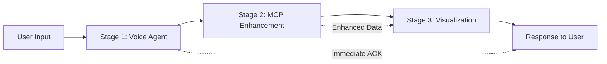
```mermaid
graph LR
    A[User Input] --> B[Stage 1: Voice Agent]
    B --> C[Stage 2: MCP Enhancement]
    C --> D[Stage 3: Visualization]
    D --> E[Response to User]
    
    B -.->|Immediate ACK| E
    C -.->|Enhanced Data| D
```

### Detailed Data Flow Diagrams

#### WebSocket Message Flow

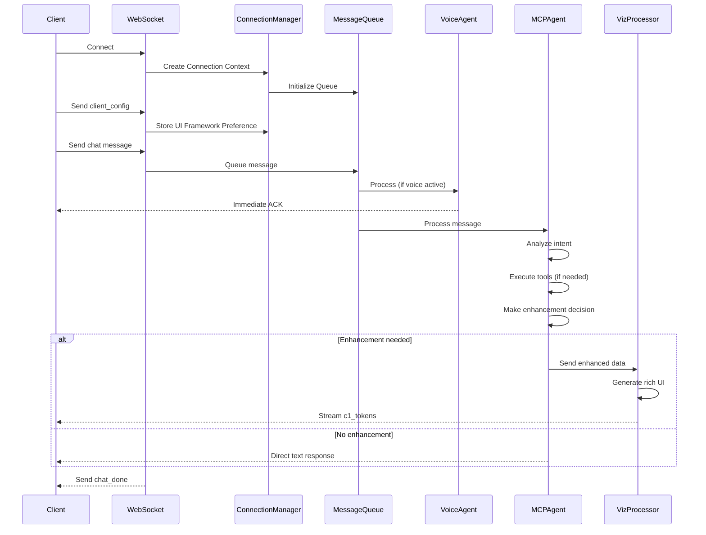
```mermaid
sequenceDiagram
    participant Client
    participant WebSocket
    participant ConnectionManager
    participant MessageQueue
    participant VoiceAgent
    participant MCPAgent
    participant VizProcessor
    
    Client->>WebSocket: Connect
    WebSocket->>ConnectionManager: Create Connection Context
    ConnectionManager->>MessageQueue: Initialize Queue
    
    Client->>WebSocket: Send client_config
    WebSocket->>ConnectionManager: Store UI Framework Preference
    
    Client->>WebSocket: Send chat message
    WebSocket->>MessageQueue: Queue message
    MessageQueue->>VoiceAgent: Process (if voice active)
    VoiceAgent-->>Client: Immediate ACK
    
    MessageQueue->>MCPAgent: Process message
    MCPAgent->>MCPAgent: Analyze intent
    MCPAgent->>MCPAgent: Execute tools (if needed)
    MCPAgent->>MCPAgent: Make enhancement decision
    
    alt Enhancement needed
        MCPAgent->>VizProcessor: Send enhanced data
        VizProcessor->>VizProcessor: Generate rich UI
        VizProcessor-->>Client: Stream c1_tokens
    else No enhancement
        MCPAgent-->>Client: Direct text response
    end
    
    WebSocket-->>Client: Send chat_done
```

#### Voice Processing Flow

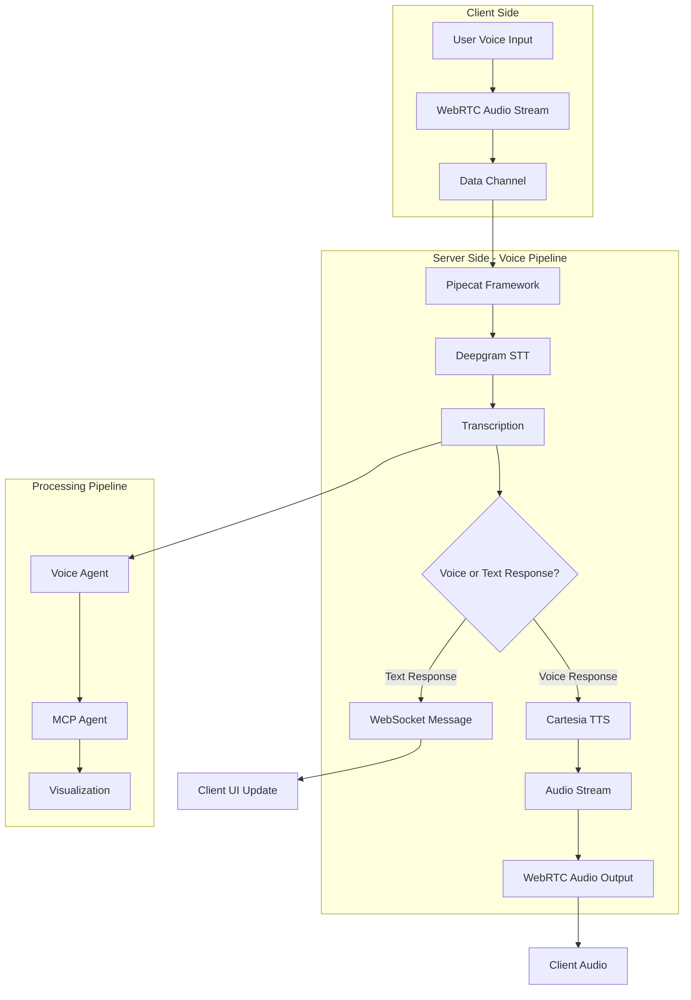
```mermaid
flowchart TB
    subgraph Client Side
        A[User Voice Input] --> B[WebRTC Audio Stream]
        B --> C[Data Channel]
    end
    
    subgraph Server Side - Voice Pipeline
        C --> D[Pipecat Framework]
        D --> E[Deepgram STT]
        E --> F[Transcription]
        F --> G{Voice or Text Response?}
        
        G -->|Voice Response| H[Cartesia TTS]
        H --> I[Audio Stream]
        I --> J[WebRTC Audio Output]
        
        G -->|Text Response| K[WebSocket Message]
    end
    
    subgraph Processing Pipeline
        F --> L[Voice Agent]
        L --> M[MCP Agent]
        M --> N[Visualization]
    end
    
    J --> O[Client Audio]
    K --> P[Client UI Update]
```

#### MCP Tool Execution Flow

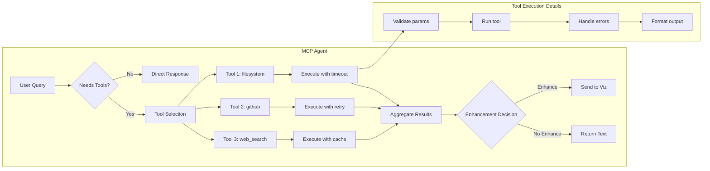
```mermaid
flowchart LR
    subgraph MCP Agent
        A[User Query] --> B{Needs Tools?}
        B -->|No| C[Direct Response]
        B -->|Yes| D[Tool Selection]
        
        D --> E[Tool 1: filesystem]
        D --> F[Tool 2: github]
        D --> G[Tool 3: web_search]
        
        E --> H[Execute with timeout]
        F --> I[Execute with retry]
        G --> J[Execute with cache]
        
        H --> K[Aggregate Results]
        I --> K
        J --> K
        
        K --> L{Enhancement Decision}
        L -->|Enhance| M[Send to Viz]
        L -->|No Enhance| N[Return Text]
    end
    
    subgraph Tool Execution Details
        H --> O[Validate params]
        O --> P[Run tool]
        P --> Q[Handle errors]
        Q --> R[Format output]
    end
```

#### Connection State Machine

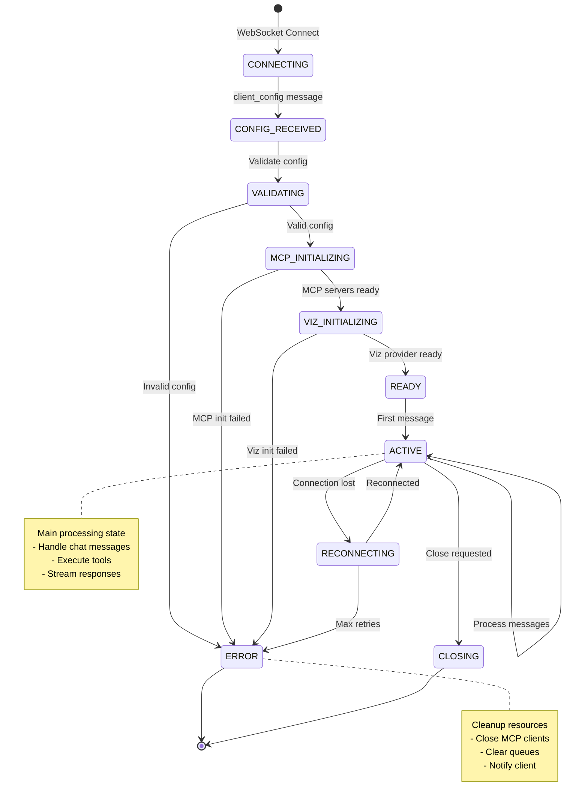
```mermaid
stateDiagram-v2
    [*] --> CONNECTING: WebSocket Connect
    
    CONNECTING --> CONFIG_RECEIVED: client_config message
    CONFIG_RECEIVED --> VALIDATING: Validate config
    
    VALIDATING --> MCP_INITIALIZING: Valid config
    VALIDATING --> ERROR: Invalid config
    
    MCP_INITIALIZING --> VIZ_INITIALIZING: MCP servers ready
    MCP_INITIALIZING --> ERROR: MCP init failed
    
    VIZ_INITIALIZING --> READY: Viz provider ready
    VIZ_INITIALIZING --> ERROR: Viz init failed
    
    READY --> ACTIVE: First message
    
    ACTIVE --> ACTIVE: Process messages
    ACTIVE --> RECONNECTING: Connection lost
    ACTIVE --> CLOSING: Close requested
    
    RECONNECTING --> ACTIVE: Reconnected
    RECONNECTING --> ERROR: Max retries
    
    ERROR --> [*]
    CLOSING --> [*]
    
    note right of ACTIVE
        Main processing state
        - Handle chat messages
        - Execute tools
        - Stream responses
    end note
    
    note right of ERROR
        Cleanup resources
        - Close MCP clients
        - Clear queues
        - Notify client
    end note
```

#### **Stage 1: Voice Agent (Immediate Acknowledgment)**
- Provides instant feedback to voice users
- Minimal processing for low latency
- Simple acknowledgments like "Let me check that for you"

#### **Stage 2: MCP Enhancement Agent**
- Executes tools and workflows
- Makes enhancement decisions
- Generates structured data responses

#### **Stage 3: Visualization Processor**
- Converts enhanced data to rich UI components
- Generates framework-specific HTML (Tailwind, Chakra, etc.)
- Creates C1 components for interactive experiences

## Fast Mode vs Slow Mode Data Flow

### Voice Bot Response Flow (2 Responses)

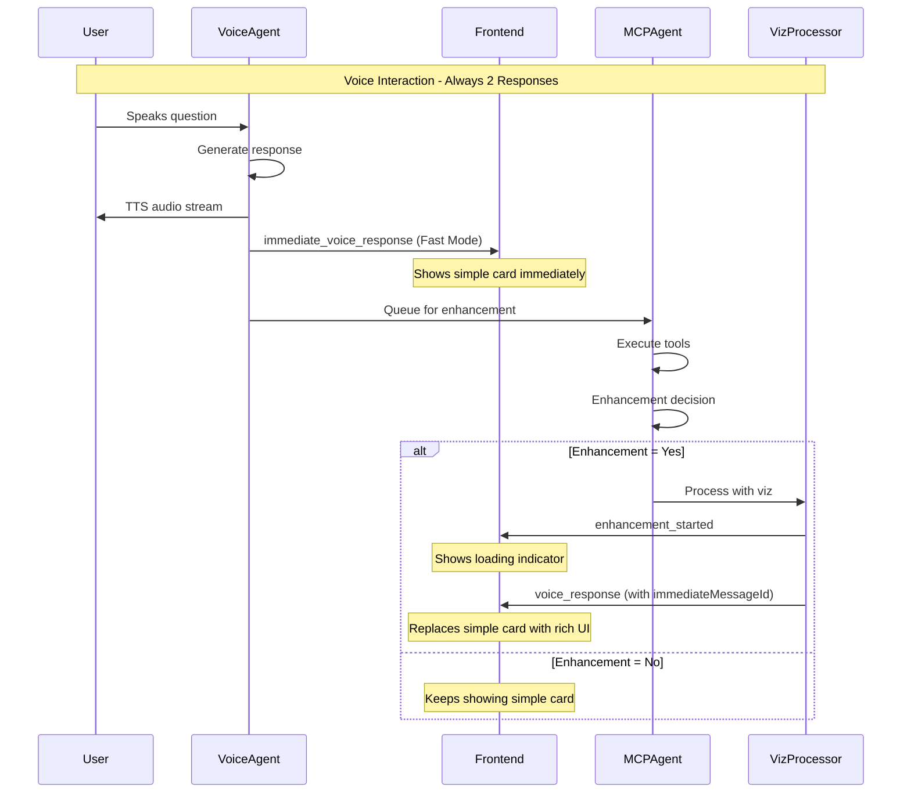
```mermaid
sequenceDiagram
    participant User
    participant VoiceAgent
    participant Frontend
    participant MCPAgent
    participant VizProcessor
    
    Note over User,VizProcessor: Voice Interaction - Always 2 Responses
    
    User->>VoiceAgent: Speaks question
    VoiceAgent->>VoiceAgent: Generate response
    VoiceAgent->>User: TTS audio stream
    VoiceAgent->>Frontend: immediate_voice_response (Fast Mode)
    Note over Frontend: Shows simple card immediately
    
    VoiceAgent->>MCPAgent: Queue for enhancement
    MCPAgent->>MCPAgent: Execute tools
    MCPAgent->>MCPAgent: Enhancement decision
    
    alt Enhancement = Yes
        MCPAgent->>VizProcessor: Process with viz
        VizProcessor->>Frontend: enhancement_started
        Note over Frontend: Shows loading indicator
        VizProcessor->>Frontend: voice_response (with immediateMessageId)
        Note over Frontend: Replaces simple card with rich UI
    else Enhancement = No
        Note over Frontend: Keeps showing simple card
    end
```

### Text Chat Response Flow (1 Response)

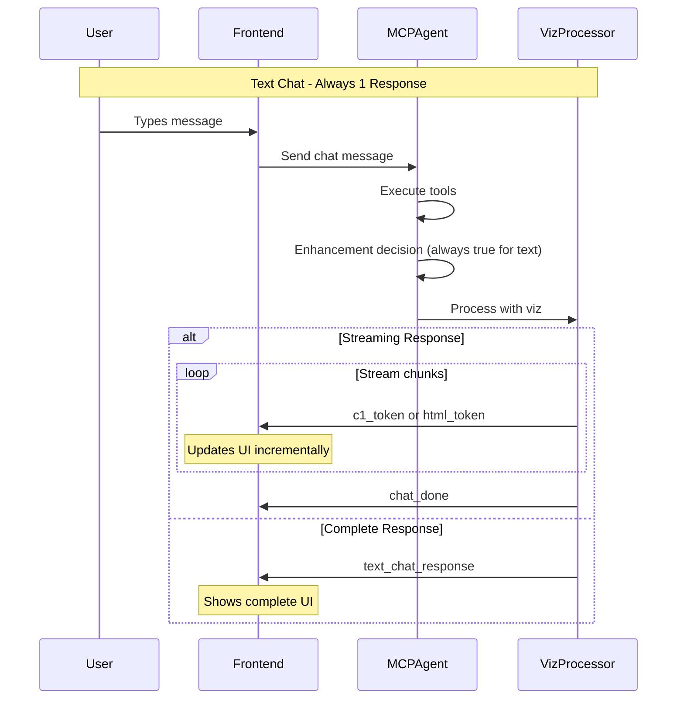
```mermaid
sequenceDiagram
    participant User
    participant Frontend
    participant MCPAgent
    participant VizProcessor
    
    Note over User,VizProcessor: Text Chat - Always 1 Response
    
    User->>Frontend: Types message
    Frontend->>MCPAgent: Send chat message
    MCPAgent->>MCPAgent: Execute tools
    MCPAgent->>MCPAgent: Enhancement decision (always true for text)
    MCPAgent->>VizProcessor: Process with viz
    
    alt Streaming Response
        loop Stream chunks
            VizProcessor->>Frontend: c1_token or html_token
            Note over Frontend: Updates UI incrementally
        end
        VizProcessor->>Frontend: chat_done
    else Complete Response
        VizProcessor->>Frontend: text_chat_response
        Note over Frontend: Shows complete UI
    end
```

### Enhancement Decision Flow

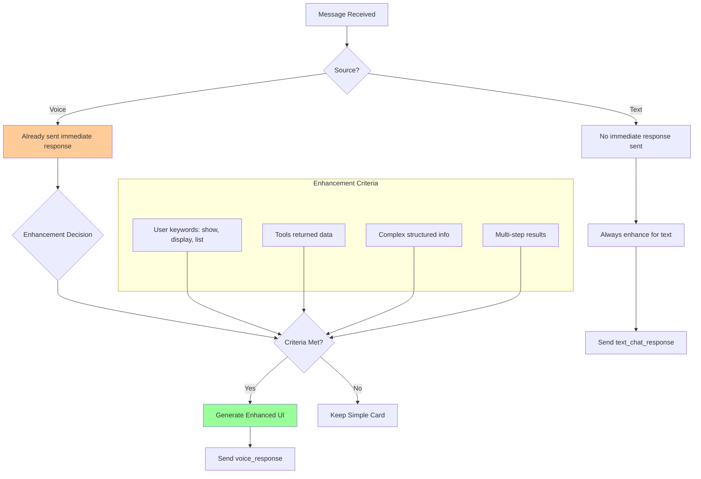
```mermaid
flowchart TB
    A[Message Received] --> B{Source?}
    
    B -->|Voice| C[Already sent immediate response]
    B -->|Text| D[No immediate response sent]
    
    C --> E{Enhancement Decision}
    D --> F[Always enhance for text]
    
    E --> G{Criteria Met?}
    G -->|Yes| H[Generate Enhanced UI]
    G -->|No| I[Keep Simple Card]
    
    subgraph Enhancement Criteria
        J[User keywords: show, display, list]
        K[Tools returned data]
        L[Complex structured info]
        M[Multi-step results]
    end
    
    J --> G
    K --> G
    L --> G
    M --> G
    
    H --> N[Send voice_response]
    F --> O[Send text_chat_response]
    
    style C fill:#ffcc99
    style H fill:#99ff99
```

### Frontend Display Logic

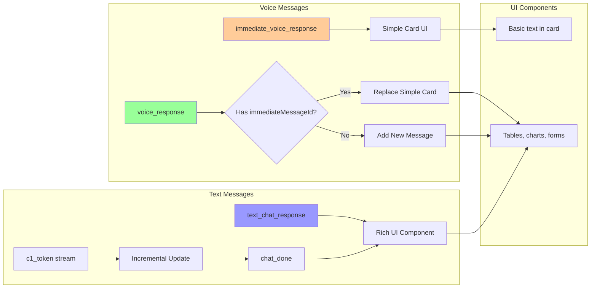
```mermaid
flowchart LR
    subgraph Voice Messages
        A[immediate_voice_response] --> B[Simple Card UI]
        C[voice_response] --> D{Has immediateMessageId?}
        D -->|Yes| E[Replace Simple Card]
        D -->|No| F[Add New Message]
    end
    
    subgraph Text Messages
        G[text_chat_response] --> H[Rich UI Component]
        I[c1_token stream] --> J[Incremental Update]
        J --> K[chat_done] --> H
    end
    
    subgraph UI Components
        B --> L[Basic text in card]
        E --> M[Tables, charts, forms]
        F --> M
        H --> M
    end
    
    style A fill:#ffcc99
    style C fill:#99ff99
    style G fill:#9999ff
```

## Fast Mode vs Slow Mode

The backend automatically switches between two processing modes based on query complexity and user intent:

### Fast Mode (No Enhancement)

**When Triggered:**
- Simple conversational queries
- No tool execution needed
- User hasn't requested specific formatting
- Quick factual responses

**Processing Flow:**
```python
User Query → Voice Agent (ACK) → MCP Agent → Decision: No Enhancement → Direct Response
```

**Characteristics:**
- **Latency**: < 500ms typical
- **Response**: Plain text or simple formatting
- **Tools**: None executed
- **Use Cases**: Greetings, simple Q&A, acknowledgments

**Example Queries:**
- "Hello"
- "What's the weather?" (without requesting display)
- "Thanks for your help"

### Slow Mode (With Enhancement)

**When Triggered:**
- User explicitly requests visualization ("show me", "display", "list")
- Complex queries requiring tool execution
- Structured data that benefits from rich UI
- Multi-step workflows

**Processing Flow:**
```python
User Query → Voice Agent (ACK) → MCP Agent → Tools → Decision: Enhance → Visualization → Rich UI
```

**Characteristics:**
- **Latency**: 2-5 seconds typical
- **Response**: Rich UI components, tables, charts, interactive elements
- **Tools**: Multiple MCP tools may be executed
- **Use Cases**: Data analysis, file operations, complex searches

**Example Queries:**
- "Show me all Python files in this directory"
- "Display a chart of sales data"
- "Create a todo list with these items"

### Enhancement Decision Logic

The MCP agent uses sophisticated logic to determine whether to enhance responses:

```python
class EnhancementDecision:
    displayEnhancement: bool      # Whether to show enhanced UI
    displayEnhancedText: str      # Text content for display
    voiceOverText: Optional[str]  # Text for TTS (if different)
```

**Decision Factors:**
1. **User Intent Keywords**: "show", "display", "visualize", "list", "format"
2. **Tool Execution Results**: Structured data from tools
3. **Data Complexity**: Tables, lists, code snippets benefit from enhancement
4. **Context**: Previous conversation may influence decisions

## Connection Management

### Connection ID Architecture

The backend uses connection IDs to maintain proper isolation between concurrent users and route messages correctly between WebRTC voice sessions and their corresponding WebSocket connections.

#### Connection ID Flow

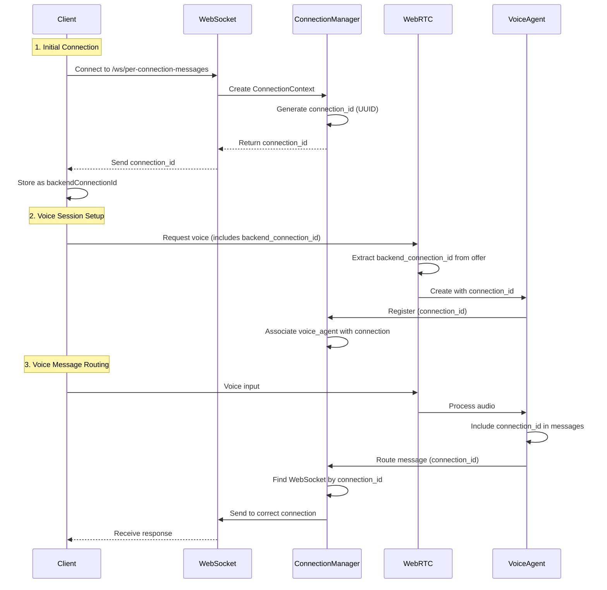
```mermaid
sequenceDiagram
    participant Client
    participant WebSocket
    participant ConnectionManager
    participant WebRTC
    participant VoiceAgent
    
    Note over Client: 1. Initial Connection
    Client->>WebSocket: Connect to /ws/per-connection-messages
    WebSocket->>ConnectionManager: Create ConnectionContext
    ConnectionManager->>ConnectionManager: Generate connection_id (UUID)
    ConnectionManager-->>WebSocket: Return connection_id
    WebSocket-->>Client: Send connection_id
    Client->>Client: Store as backendConnectionId
    
    Note over Client: 2. Voice Session Setup
    Client->>WebRTC: Request voice (includes backend_connection_id)
    WebRTC->>WebRTC: Extract backend_connection_id from offer
    WebRTC->>VoiceAgent: Create with connection_id
    VoiceAgent->>ConnectionManager: Register (connection_id)
    ConnectionManager->>ConnectionManager: Associate voice_agent with connection
    
    Note over Client: 3. Voice Message Routing
    Client->>WebRTC: Voice input
    WebRTC->>VoiceAgent: Process audio
    VoiceAgent->>VoiceAgent: Include connection_id in messages
    VoiceAgent->>ConnectionManager: Route message (connection_id)
    ConnectionManager->>ConnectionManager: Find WebSocket by connection_id
    ConnectionManager->>WebSocket: Send to correct connection
    WebSocket-->>Client: Receive response
```

#### Connection Registry Structure

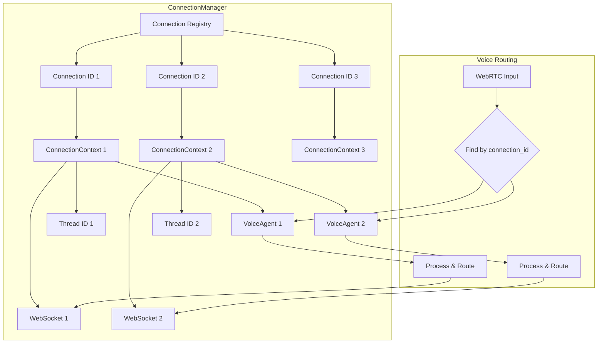
```mermaid
flowchart TB
    subgraph ConnectionManager
        A[Connection Registry]
        A --> B[Connection ID 1]
        A --> C[Connection ID 2]
        A --> D[Connection ID 3]
        
        B --> E[ConnectionContext 1]
        C --> F[ConnectionContext 2]
        D --> G[ConnectionContext 3]
        
        E --> H[WebSocket 1]
        E --> I[VoiceAgent 1]
        E --> J[Thread ID 1]
        
        F --> K[WebSocket 2]
        F --> L[VoiceAgent 2]
        F --> M[Thread ID 2]
    end
    
    subgraph Voice Routing
        N[WebRTC Input] --> O{Find by connection_id}
        O --> I
        O --> L
        
        I --> P[Process & Route]
        L --> Q[Process & Route]
        
        P --> H
        Q --> K
    end
```

### How WebRTC Routes to Correct WebSocket

The key mechanism that allows WebRTC to send responses to the correct WebSocket connection:

1. **Connection ID Handshake**
   - WebSocket establishes connection first and receives a unique `connection_id`
   - Client stores this ID and includes it in the WebRTC offer
   - WebRTC handler extracts `backend_connection_id` from the offer payload

2. **Voice Agent Registration**
   - Each VoiceAgent is created with the `connection_id` from the WebRTC offer
   - VoiceAgent registers itself with ConnectionManager using this ID
   - ConnectionManager maintains the mapping: `connection_id → {websocket, voice_agent}`

3. **Message Routing**
   - When voice generates a response, it includes the `connection_id`
   - VoiceBroadcastManager uses this ID to find subscribers
   - ConnectionManager looks up the WebSocket using the connection_id
   - Response is sent through the correct WebSocket connection

4. **Thread ID for Voice Continuity**
   - Each voice session also has a `thread_id` for conversation continuity
   - Mapping maintained: `thread_id → connection_id → websocket`
   - Ensures voice responses go to the right user even with multiple concurrent sessions

Example flow:
```
User A (WebSocket 1) → connection_id: "abc-123" → WebRTC with "abc-123" → Responses to WebSocket 1
User B (WebSocket 2) → connection_id: "def-456" → WebRTC with "def-456" → Responses to WebSocket 2
```

### Per-Connection Architecture

Each WebSocket connection maintains isolated state:

```python
class ConnectionContext:
    connection_id: str           # Unique identifier
    mcp_client: MCPClient       # Dedicated MCP client instance
    viz_provider: Provider      # Visualization provider
    message_queue: Queue        # Async message processing
    voice_agent: Optional[...]  # Voice processing (if connected)
    state: ConnectionState      # Current connection state
```

### Connection Lifecycle

```
CONNECTING → CONFIG_RECEIVED → VALIDATING → MCP_INITIALIZING → VIZ_INITIALIZING → READY → ACTIVE
```

1. **CONNECTING**: WebSocket established
2. **CONFIG_RECEIVED**: Client sends UI framework preference
3. **VALIDATING**: Checking client configuration
4. **MCP_INITIALIZING**: Starting MCP servers
5. **VIZ_INITIALIZING**: Setting up visualization provider
6. **READY**: All systems initialized
7. **ACTIVE**: Processing messages

#### Enhancement Decision Flow

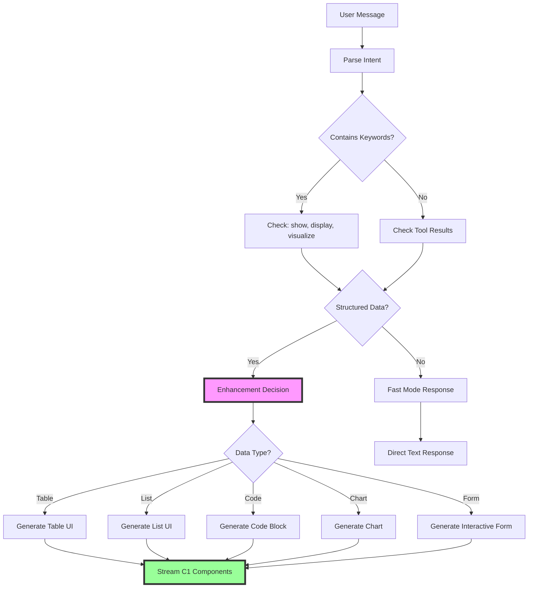
```mermaid
flowchart TB
    A[User Message] --> B[Parse Intent]
    
    B --> C{Contains Keywords?}
    C -->|Yes| D[Check: show, display, visualize]
    C -->|No| E[Check Tool Results]
    
    D --> F{Structured Data?}
    E --> F
    
    F -->|Yes| G[Enhancement Decision]
    F -->|No| H[Fast Mode Response]
    
    G --> I{Data Type?}
    I -->|Table| J[Generate Table UI]
    I -->|List| K[Generate List UI]
    I -->|Code| L[Generate Code Block]
    I -->|Chart| M[Generate Chart]
    I -->|Form| N[Generate Interactive Form]
    
    J --> O[Stream C1 Components]
    K --> O
    L --> O
    M --> O
    N --> O
    
    H --> P[Direct Text Response]
    
    style G fill:#f9f,stroke:#333,stroke-width:4px
    style O fill:#9f9,stroke:#333,stroke-width:4px
```

#### Streaming Response Architecture

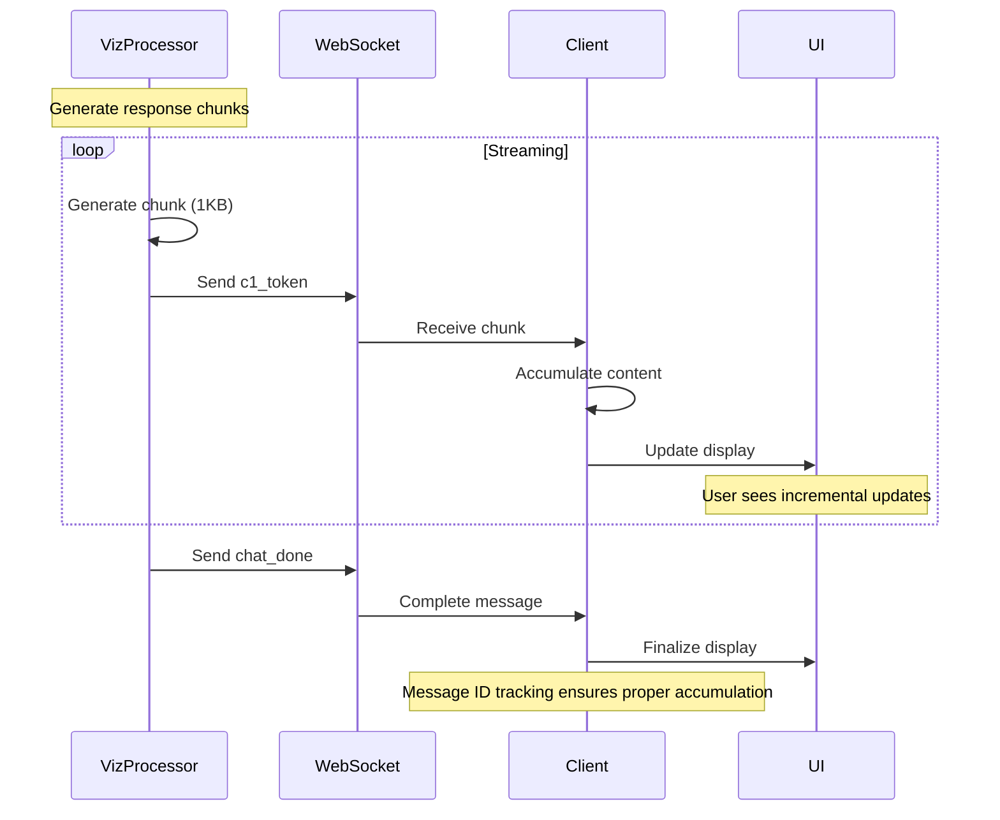
```mermaid
sequenceDiagram
    participant VizProcessor
    participant WebSocket
    participant Client
    participant UI
    
    Note over VizProcessor: Generate response chunks
    
    loop Streaming
        VizProcessor->>VizProcessor: Generate chunk (1KB)
        VizProcessor->>WebSocket: Send c1_token
        WebSocket->>Client: Receive chunk
        Client->>Client: Accumulate content
        Client->>UI: Update display
        Note over UI: User sees incremental updates
    end
    
    VizProcessor->>WebSocket: Send chat_done
    WebSocket->>Client: Complete message
    Client->>UI: Finalize display
    
    Note over Client: Message ID tracking ensures proper accumulation
```

#### Error Handling and Recovery Flow

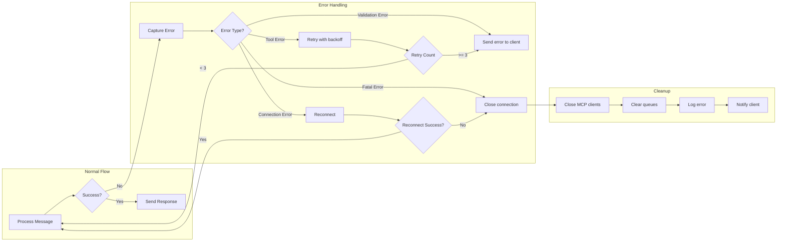
```mermaid
flowchart LR
    subgraph Normal Flow
        A[Process Message] --> B{Success?}
        B -->|Yes| C[Send Response]
    end
    
    subgraph Error Handling
        B -->|No| D[Capture Error]
        D --> E{Error Type?}
        
        E -->|Tool Error| F[Retry with backoff]
        E -->|Connection Error| G[Reconnect]
        E -->|Validation Error| H[Send error to client]
        E -->|Fatal Error| I[Close connection]
        
        F --> J{Retry Count}
        J -->|< 3| A
        J -->|>= 3| H
        
        G --> K{Reconnect Success?}
        K -->|Yes| A
        K -->|No| I
    end
    
    subgraph Cleanup
        I --> L[Close MCP clients]
        L --> M[Clear queues]
        M --> N[Log error]
        N --> O[Notify client]
    end
```

## Data Flow Summary

### Key Points About Response Counts

#### Voice Bot Interactions
- **Always sends 2 responses to frontend**:
  1. **Immediate response** (`immediate_voice_response`) - Simple card shown instantly while user hears TTS
  2. **Enhanced response** (`voice_response`) - Rich UI that replaces the simple card (if enhancement is needed)
- The `immediateMessageId` field links the two responses so frontend knows to replace rather than append

#### Text Chat Interactions
- **Always sends 1 response to frontend**:
  - Goes directly to enhancement processing (no immediate response)
  - Always enhanced for text chat (bypass enhancement decision)
  - Sent as `text_chat_response` with either C1 content or HTML

### Message Timing and Display


```mermaid
gantt
    title Response Timeline
    dateFormat X
    axisFormat %s
    
    section Voice Bot
    User speaks           :0, 1
    TTS Audio plays       :1, 3
    Immediate response    :crit, 1, 1
    Tool execution        :2, 3
    Enhancement process   :5, 2
    Enhanced response     :milestone, 7, 0
    
    section Text Chat
    User types           :0, 1
    Tool execution       :1, 3
    Enhancement process  :4, 2
    Response sent        :milestone, 6, 0
```

### Frontend Handling

1. **Voice Messages**:
   - `immediate_voice_response` → Creates new message with simple card
   - `voice_response` with `immediateMessageId` → Finds and replaces the simple card
   - Both contain the same message ID for continuity

2. **Text Messages**:
   - `text_chat_response` → Creates new message with rich content
   - May stream via `c1_token`/`html_token` → `chat_done` sequence

3. **User Transcriptions**:
   - `user_transcription` → Shows what the user said
   - Appears before the assistant's responses

## Message Flow

### WebSocket Messages

**Client → Server:**
```json
{
  "type": "chat",
  "content": "Show me all Python files",
  "messageId": "unique-id"
}
```

**Server → Client (Streaming):**
```json
// Start streaming
{
  "type": "c1_token",
  "content": "<content>",
  "id": "message-id"
}

// Continue streaming
{
  "type": "c1_token", 
  "content": "<table>...",
  "id": "message-id"
}

// End streaming
{
  "type": "chat_done",
  "id": "message-id"
}
```

### Voice Processing

**WebRTC Flow:**
1. Client sends offer to `/api/offer`
2. Server creates peer connection
3. Voice stream processed by Pipecat
4. Transcriptions sent as chat messages
5. Enhanced responses get TTS treatment

## MCP (Model Context Protocol) Integration

### MCP Server Configuration

The backend connects to multiple MCP servers for different capabilities:

```python
MCP_SERVERS = {
    "filesystem": {
        "command": "npx",
        "args": ["-y", "@modelcontextprotocol/server-filesystem", "/Users/path"],
        "alwaysAllow": ["read_file", "list_directory"]
    },
    "github": {
        "command": "npx",
        "args": ["-y", "@modelcontextprotocol/server-github"],
        "env": {"GITHUB_PERSONAL_ACCESS_TOKEN": "..."}
    }
}
```

### Tool Execution

**Available Tools:**
- File system operations (read, write, list)
- GitHub integration
- Web search and fetch
- Memory/notes management
- Git operations
- Database queries

**Execution Limits:**
- Maximum 10 tool calls per enhancement decision
- Timeout protection for long-running tools
- Automatic retry with exponential backoff

## Visualization System

### Provider Types

1. **TheSys Provider** (C1 Components)
   - Rich, interactive components
   - Real-time streaming updates
   - Framework-agnostic

2. **OpenAI/Anthropic Providers** (HTML)
   - Framework-specific HTML generation
   - Supports: Tailwind, Chakra UI, Material UI, Ant Design
   - Client-side event handling

### Streaming Architecture

```python
# Incremental streaming for real-time updates
async def stream_response(content_generator):
    async for chunk in content_generator:
        await websocket.send_json({
            "type": "c1_token",
            "content": chunk,
            "id": message_id
        })
```

## Configuration

### Environment Variables

```bash
# API Keys
OPENAI_API_KEY=sk-...
ANTHROPIC_API_KEY=sk-ant-...
DEEPGRAM_API_KEY=...
CARTESIA_API_KEY=...

# Model Configuration
OPENAI_MODEL=gpt-4o
ANTHROPIC_MODEL=claude-3-5-haiku-latest

# Server Settings
BACKEND_HOST=0.0.0.0
BACKEND_PORT=8000
BACKEND_RELOAD=true

# Feature Flags
ENABLE_VOICE=true
MAX_TOOL_CALLS=10
STREAMING_CHUNK_SIZE=1000
```

### Dynamic Configuration

```python
# Runtime configuration via client
{
  "type": "client_config",
  "uiFramework": "tailwind",  # UI framework preference
  "theme": "dark",             # Theme preference
  "features": {
    "voice": true,
    "enhancement": true
  }
}
```

## Performance Optimizations

### 1. Streaming Responses
- Start displaying content immediately
- Chunk size optimization (1KB default)
- Backpressure handling

### 2. Connection Pooling
- Reuse MCP server connections
- WebSocket connection recycling
- Database connection pooling

### 3. Async Processing
- Queue-based message handling
- Non-blocking I/O operations
- Concurrent tool execution

### 4. Selective Enhancement
- Smart decision logic
- Skip enhancement for simple queries
- Cache enhancement decisions

## Security Features

### 1. Input Validation
- WebSocket message validation
- Tool parameter sanitization
- URL validation for web operations

### 2. Authentication Hooks
- Client authentication support
- Per-connection authorization
- API key management

### 3. Resource Limits
- Maximum message size limits
- Tool execution timeouts
- Connection rate limiting

## Deployment Considerations

### Production Setup

```bash
# Using Uvicorn with Gunicorn
gunicorn app.server:app \
  --workers 4 \
  --worker-class uvicorn.workers.UvicornWorker \
  --bind 0.0.0.0:8000

# Or direct Uvicorn for development
uvicorn app.server:app --reload --host 0.0.0.0 --port 8000
```

### Scaling Strategies

1. **Horizontal Scaling**: Multiple backend instances behind load balancer
2. **Connection Affinity**: Sticky sessions for WebSocket connections
3. **MCP Server Pool**: Pre-warmed MCP server instances
4. **Cache Layer**: Redis for enhancement decision caching

### Monitoring

Key metrics to track:
- Enhancement decision ratio (fast vs slow mode)
- Average tool execution time
- WebSocket connection duration
- Message processing latency
- MCP server health

## Common Issues and Troubleshooting

### Issue: Slow Enhancement Decisions
**Cause**: Too many tool executions
**Solution**: Optimize prompt to reduce tool calls, implement caching

### Issue: WebSocket Disconnections
**Cause**: Long-running operations blocking event loop
**Solution**: Use background tasks for heavy processing

### Issue: Memory Leaks
**Cause**: MCP clients not properly cleaned up
**Solution**: Ensure proper connection cleanup in finally blocks

### Issue: Voice Latency
**Cause**: TTS generation blocking
**Solution**: Pre-generate common responses, use streaming TTS

## Future Enhancements

1. **Adaptive Mode Selection**: ML-based prediction of enhancement needs
2. **Response Caching**: Cache common enhanced responses
3. **Federated MCP**: Distribute tool execution across servers
4. **Progressive Enhancement**: Start with fast mode, upgrade to slow if needed
5. **Client-Side Rendering**: Move some visualization to client

## Debugging Guide

### Message Type Flow Chart

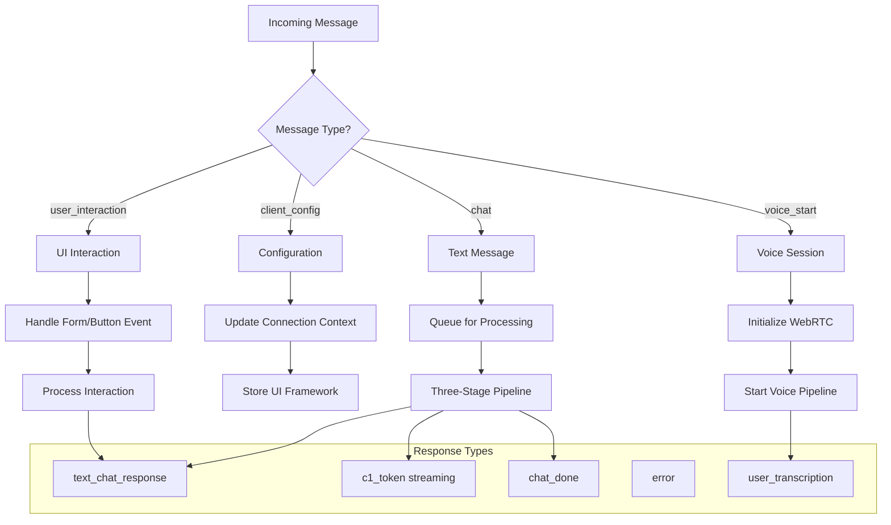
```mermaid
flowchart TD
    A[Incoming Message] --> B{Message Type?}
    
    B -->|chat| C[Text Message]
    B -->|client_config| D[Configuration]
    B -->|user_interaction| E[UI Interaction]
    B -->|voice_start| F[Voice Session]
    
    C --> G[Queue for Processing]
    D --> H[Update Connection Context]
    E --> I[Handle Form/Button Event]
    F --> J[Initialize WebRTC]
    
    G --> K[Three-Stage Pipeline]
    H --> L[Store UI Framework]
    I --> M[Process Interaction]
    J --> N[Start Voice Pipeline]
    
    subgraph Response Types
        O[text_chat_response]
        P[c1_token streaming]
        Q[chat_done]
        R[error]
        S[user_transcription]
    end
    
    K --> O
    K --> P
    K --> Q
    M --> O
    N --> S
```

### Performance Monitoring Points

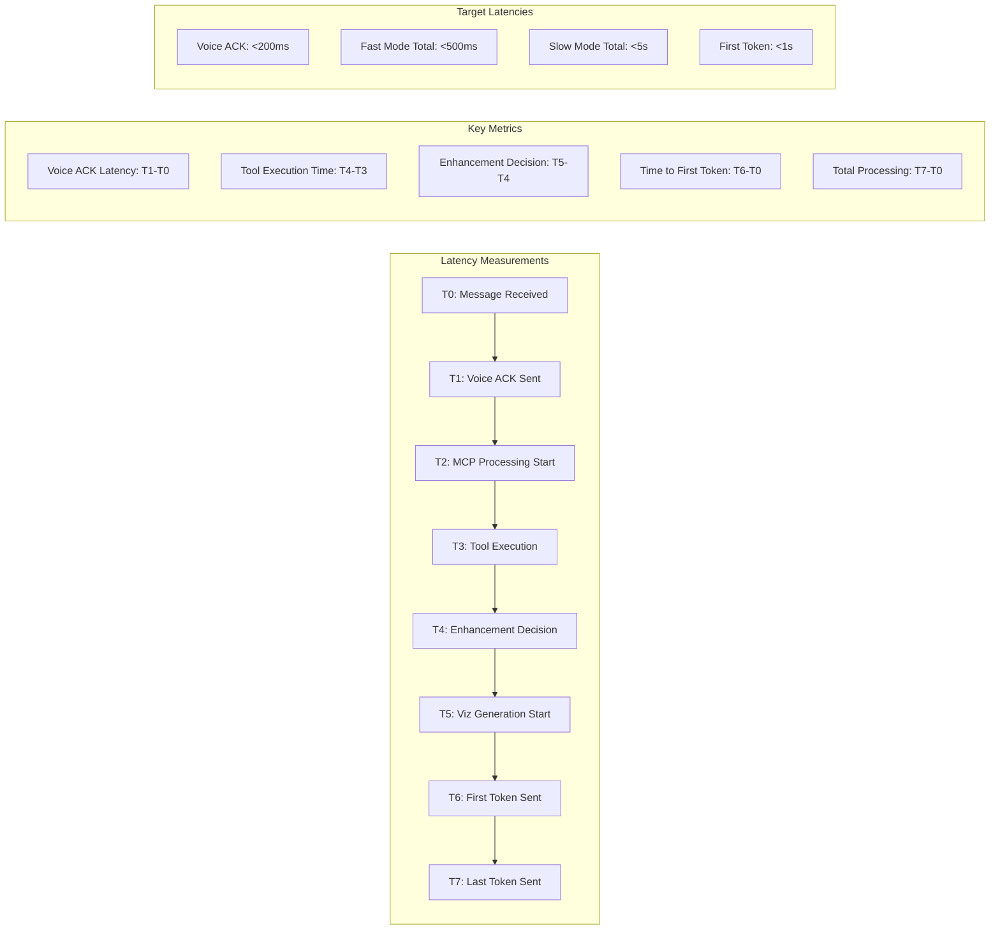
```mermaid
flowchart LR
    subgraph Latency Measurements
        A[T0: Message Received] --> B[T1: Voice ACK Sent]
        B --> C[T2: MCP Processing Start]
        C --> D[T3: Tool Execution]
        D --> E[T4: Enhancement Decision]
        E --> F[T5: Viz Generation Start]
        F --> G[T6: First Token Sent]
        G --> H[T7: Last Token Sent]
    end
    
    subgraph Key Metrics
        I[Voice ACK Latency: T1-T0]
        J[Tool Execution Time: T4-T3]
        K[Enhancement Decision: T5-T4]
        L[Time to First Token: T6-T0]
        M[Total Processing: T7-T0]
    end
    
    subgraph Target Latencies
        N[Voice ACK: <200ms]
        O[Fast Mode Total: <500ms]
        P[Slow Mode Total: <5s]
        Q[First Token: <1s]
    end
```

### Concurrent Connection Management

```mermaid
flowchart TB
    subgraph Connection Pool
        A[Connection 1] --> B[Context 1]
        C[Connection 2] --> D[Context 2]
        E[Connection 3] --> F[Context 3]
        
        B --> G[MCP Client 1]
        B --> H[Viz Provider 1]
        B --> I[Message Queue 1]
        
        D --> J[MCP Client 2]
        D --> K[Viz Provider 2]
        D --> L[Message Queue 2]
        
        F --> M[MCP Client 3]
        F --> N[Viz Provider 3]
        F --> O[Message Queue 3]
    end
    
    subgraph Isolation
        P[No shared state between connections]
        Q[Independent MCP servers per connection]
        R[Separate message queues]
        S[Isolated error handling]
    end
    
    Note over Connection Pool: Each connection is fully isolated
```

## Summary

The GenUX backend implements a sophisticated multi-modal AI system that intelligently switches between fast and slow processing modes. This architecture provides:

- **Immediate feedback** through the voice agent
- **Rich interactions** through MCP tool execution
- **Beautiful visualizations** through the visualization processor
- **Optimal performance** through smart enhancement decisions

The key innovation is the three-stage pipeline that allows the system to acknowledge users immediately while processing complex enhancements in the background, creating a responsive yet powerful user experience.

### Quick Debugging Reference

1. **Check Connection State**: Look for state transitions in logs
2. **Monitor Message Flow**: Track message IDs through the pipeline
3. **Measure Latencies**: Use performance monitoring points
4. **Verify Isolation**: Ensure connections don't interfere
5. **Test Error Recovery**: Simulate failures at each stage