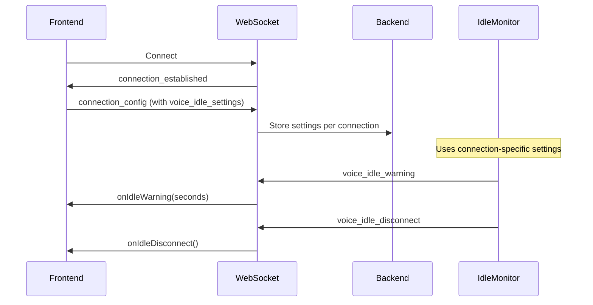

# Frontend-Controlled Voice Idle Timeout

## Overview
Voice idle timeout can now be configured from the frontend on a per-connection basis, allowing different users or applications to have different timeout settings without backend changes.

## Configuration Options

### Frontend Configuration (Recommended)
Configure timeout settings when initializing the SDK:

```typescript
// Using Genux component
<Genux
  webrtcURL="/api/offer"
  websocketURL="/ws/per-connection-messages"
  options={{
    voiceIdleTimeout: {
      enabled: true,              // Enable/disable timeout
      disconnectThreshold: 60,    // Seconds before disconnect
      warningThreshold: 50,       // When to show warning
      onIdleWarning: (seconds) => {
        // Handle warning (e.g., show notification)
      },
      onIdleDisconnect: () => {
        // Handle disconnect (e.g., update UI)
      }
    }
  }}
/>

// Using useGeUIClient hook
const client = useGeUIClient({
  webrtcURL: '/api/offer',
  websocketURL: '/ws/per-connection-messages',
  voiceIdleTimeout: {
    enabled: true,
    disconnectThreshold: 120,  // 2 minutes
    warningThreshold: 90,      // Warning at 1.5 minutes
    onIdleWarning: (secondsRemaining) => {
      showToast(`Voice disconnecting in ${secondsRemaining}s`);
    },
    onIdleDisconnect: () => {
      showToast('Voice disconnected due to inactivity');
    }
  }
});
```

### Backend Defaults (Fallback)
If frontend doesn't specify settings, backend environment variables are used:
- `VOICE_IDLE_TIMEOUT`: Default timeout in seconds
- `VOICE_IDLE_WARNING_TIME`: Seconds before timeout to show warning
- `VOICE_IDLE_CHECK_INTERVAL`: How often to check for idle connections

## Use Cases

### 1. Accessibility - Extended Timeout
Users who need more time can configure longer timeouts:
```typescript
voiceIdleTimeout: {
  enabled: true,
  disconnectThreshold: 300,  // 5 minutes
  warningThreshold: 240      // Warning at 4 minutes
}
```

### 2. Kiosk Mode - Short Timeout
Public terminals can use aggressive timeouts:
```typescript
voiceIdleTimeout: {
  enabled: true,
  disconnectThreshold: 30,   // 30 seconds
  warningThreshold: 25       // Warning at 25 seconds
}
```

### 3. Support Calls - No Timeout
Customer support can disable timeout completely:
```typescript
voiceIdleTimeout: {
  enabled: false  // No timeout
}
```

### 4. Dynamic Configuration
Change timeout based on user preferences:
```typescript
const [timeoutEnabled, setTimeoutEnabled] = useState(true);
const [timeoutSeconds, setTimeoutSeconds] = useState(60);

const client = useGeUIClient({
  voiceIdleTimeout: {
    enabled: timeoutEnabled,
    disconnectThreshold: timeoutSeconds,
    warningThreshold: timeoutSeconds - 10
  }
});
```

## How It Works

1. **Frontend sends configuration** during WebSocket connection setup
2. **Backend stores settings** per connection in ConnectionContext
3. **VoiceIdleMonitor** uses connection-specific settings instead of global config
4. **Warning/disconnect messages** sent to specific connection

## Message Flow



## API Reference

### TypeScript Types
```typescript
interface VoiceIdleTimeout {
  /** Whether to enable voice idle timeout (default: true) */
  enabled?: boolean;
  
  /** Seconds of inactivity before disconnecting (default: 60) */
  disconnectThreshold?: number;
  
  /** Seconds of inactivity before showing warning (default: 50) */
  warningThreshold?: number;
  
  /** Callback when idle warning is shown */
  onIdleWarning?: (secondsRemaining: number) => void;
  
  /** Callback when voice is disconnected due to idle */
  onIdleDisconnect?: () => void;
  
  /** Custom warning message (can include {seconds} placeholder) */
  warningMessage?: string;
  
  /** Custom disconnect message */
  disconnectMessage?: string;
}
```

### Backend Models
```python
class VoiceIdleSettings(BaseModel):
    """Per-connection voice idle timeout settings"""
    enabled: bool = True
    timeout_seconds: int = 60
    warning_seconds: int = 50
```

## Migration Guide

### From Backend-Only to Frontend-Controlled

Before (backend-only):
```bash
# All connections use same timeout
VOICE_IDLE_TIMEOUT=60 python main.py
```

After (frontend-controlled):
```typescript
// Each connection can have different settings
<Genux
  options={{
    voiceIdleTimeout: {
      disconnectThreshold: userPreferences.voiceTimeout || 60
    }
  }}
/>
```

### Backward Compatibility
- If frontend doesn't send `voice_idle_settings`, backend defaults are used
- Existing deployments continue to work without changes
- Frontend configuration overrides backend when provided

## Best Practices

1. **Always provide callbacks** for better UX:
   ```typescript
   onIdleWarning: (seconds) => showWarningBanner(seconds),
   onIdleDisconnect: () => showReconnectButton()
   ```

2. **Validate thresholds** on frontend:
   ```typescript
   const threshold = Math.max(10, Math.min(300, userInput));
   const warning = Math.max(5, threshold - 10);
   ```

3. **Consider user preferences**:
   ```typescript
   const getTimeoutForUser = (user) => {
     if (user.needsAccessibility) return 300;
     if (user.isGuest) return 30;
     return 60;
   };
   ```

4. **Show visual indicators** when idle timer is active
5. **Allow users to extend** timeout before disconnect
6. **Save preferences** for returning users

## Troubleshooting

### Settings not applying?
- Ensure using `/ws/per-connection-messages` endpoint
- Check browser console for configuration logs
- Verify backend received `connection_config` message

### Warning not showing?
- Check `warningThreshold < disconnectThreshold`
- Ensure callbacks are defined
- Verify connection has voice enabled

### Timeout too aggressive?
- Increase `disconnectThreshold`
- Consider disabling for certain users
- Check if user is speaking but not being detected