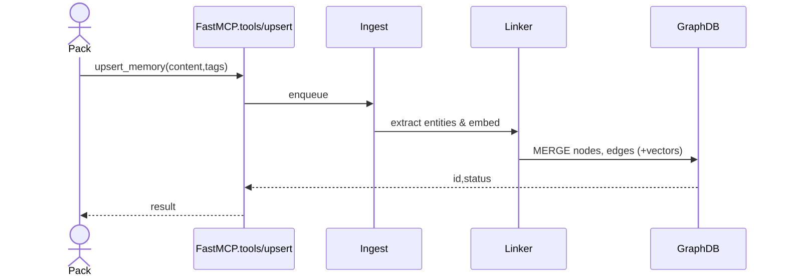
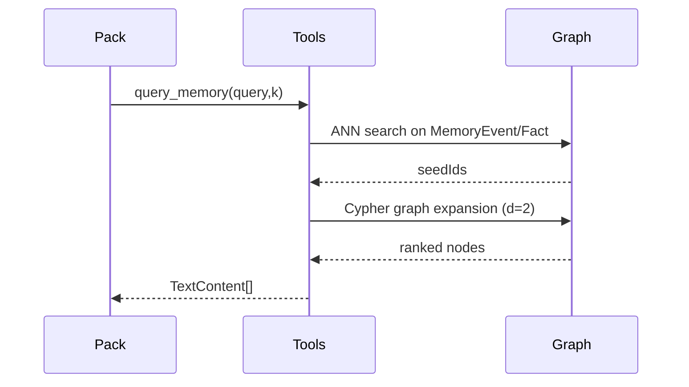
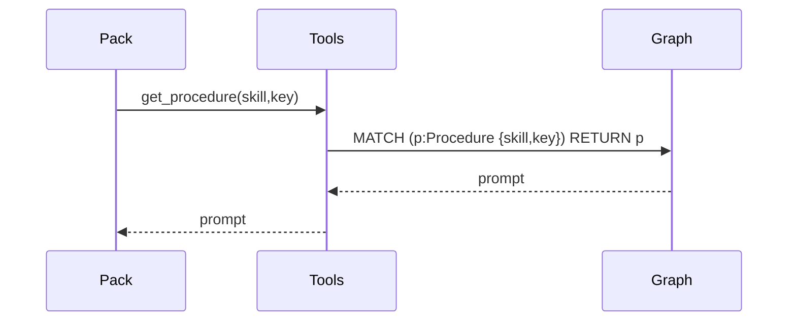

# Memory MCP Server — Graph‑Based Design (v0.2 alpha)

---

## 1 Executive Summary

This Memory MCP Server provides a **local, privacy‑preserving “second‑brain”** for AI skill‑packs. It stores episodic, semantic, and procedural memories in a single **property graph (Mem0g)** running on a self‑hosted Memgraph/Neo4j instance. Via Model Context Protocol (MCP) endpoints, clients can ingest, query, and traverse the graph to retrieve hyper‑personalised context—fueling assistants that save Founders, Staff Engineers, and Product Managers 2–3 hours every day.

---

## 2 Personas & Core Use‑Cases

| Persona                            | High‑Leverage Tasks                                                                       | Memory Needed                                                                     |
| ---------------------------------- | ----------------------------------------------------------------------------------------- | --------------------------------------------------------------------------------- |
| **Founder / CEO**                  | *Inbox zero on commute*, auto‑built board decks, calendar clustering, travel optimisation | Meeting episodes, KPI facts, procedural email/ deck prompts                       |
| **Staff / Principal Engineer**     | Hands‑free PR review, architecture RFC drafting, inline code search                       | Diff episodes, tech‑stack facts, procedural review tone                           |
| **Product Manager**                | PRD generation from transcripts, roadmap forecasting, stakeholder nudges                  | Meeting notes (episodic), feature facts (semantic), procedural Slack/email styles |
| **Extensible Skills**(Marketplace) | Travel agent, deep‑research assistant, social‑media writer, QA harness runner             | Skill‑specific entities, prompts, & user preferences                              |

> **Why personas matter:** Each task comes down to *“Find the right slice of memory, apply the correct procedure, act.”* The graph lets any new skill pack plug into the same substrate without schema changes.

---

## 3 Extensibility Model

| Layer                  | Extension Mechanism                                                                 | Example                                               |
| ---------------------- | ----------------------------------------------------------------------------------- | ----------------------------------------------------- |
| **Skill Packs**        | Drop‑in folder with `skill.yaml` manifest (`skill:id`, `graph_filter`, `tool_defs`) | `email_writer`, `code_review_pack`                    |
| **Graph Schema**       | New `Entity` types or edge labels (namespaced)                                      | `(:Airport)` node, `(:Flight)-[:PREFERS]->(:Airline)` |
| **Procedural Prompts** | Stored as `(:Procedure {skill, key, prompt})` nodes                                 | `key:"investor_update_tone"`                          |
| **Vector Models**      | Pack can ship alternative embedder; vector dims stored on node prop `model_id`      | `all-MiniLM`, `instructor-xl`                         |

Packs declare CRUD scopes; orchestrator enforces that packs only touch their namespace—enabling a **safe marketplace** while avoiding migration overhead.

---

## 4 High‑Level Architecture (unchanged)

```
FastMCP (FastAPI) ── tools/* → Ingestion → Entity‑Linker → GraphDB ↔ Vector Idx
                                  ↑                       ↓
                    sampling/createMessage  ←─ Summariser ─┘
```

---

## 5 Graph Schema (Mem0g)

### Node Labels

* **MemoryEvent** (`memory_type:"episodic"`)
* **MemoryFact**  (`memory_type:"semantic"`)
* **Procedure**   (`memory_type:"procedural"`)
* **Entity**      (`type:"PERSON"|"PROJECT"|…`)

### Edge Types

`MENTIONS`, `ABOUT`, `DERIVED_FROM`, `NEXT`, `IMPLEMENTS`

---

## 6 Key Sequences

### 6.1 Upsert Memory



### 6.2 Query Memory



### 6.3 Procedural Prompt Fetch



---

## 7 MCP Tool Definitions (excerpt)

| Name                 | Description                | readOnly | Input Schema                                    |
| -------------------- | -------------------------- | -------- | ----------------------------------------------- |
| `upsert_memory`      | Add/update graph node(s)   | ❌        | `{ skill, memory_type, content, tags?, meta? }` |
| `query_memory`       | Vector + graph search      | ✅        | `{ query, k?, memory_type?, skill?, filter? }`  |
| `list_memory_items`  | Paginated metadata         | ✅        | `{ cursor?, limit?, filter? }`                  |
| `get_procedure`      | Retrieve procedural prompt | ✅        | `{ skill, key }`                                |
| `delete_memory_item` | Hard delete                | ❌        | `{ id }`                                        |
| `reindex_embeddings` | Re‑embed selected nodes    | ❌        | `{ ids?, model_id? }`                           |

All responses conform to MCP `TextContent` or `ToolCallResult` formats.

---

## 8 Resource Exposure

* **URI Scheme**: `memory://<label>/<uuid>` for direct node fetch; `memory://query/<qid>/result/<rank>` for search hits.
* **resources/list** streams all URIs that match a graph filter (cursor‑paged).
* **resources/read** returns `{ text, meta, neighbours? }`; includes change tokens so clients can subscribe to updates.
* **Change Notifications**: Graph triggers emit `resource/update` SSE frames when node content/props change.

---

## 9 Migration Plan (SQLite → Graph)

1. Export SQLite rows as JSONL.
2. Bulk import into GraphDB using `LOAD CSV` / MAGE.
3. Batch EMBED & attach vectors.
4. Re‑run regression queries for each skill pack.

---

## 10 Open Questions

1. **GraphDB choice**: Memgraph&#x20;
2. **Edge weighting** per skill for optimal rerank.
3. **Procedural prompt versioning**—simple integer 
4. **Episodic retention policy**— cold‑archive.