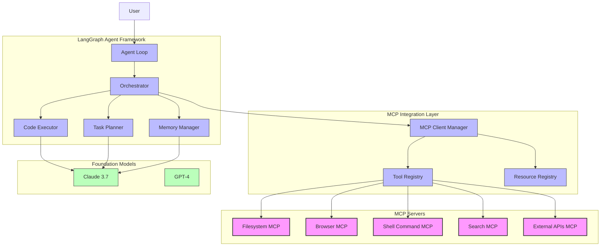
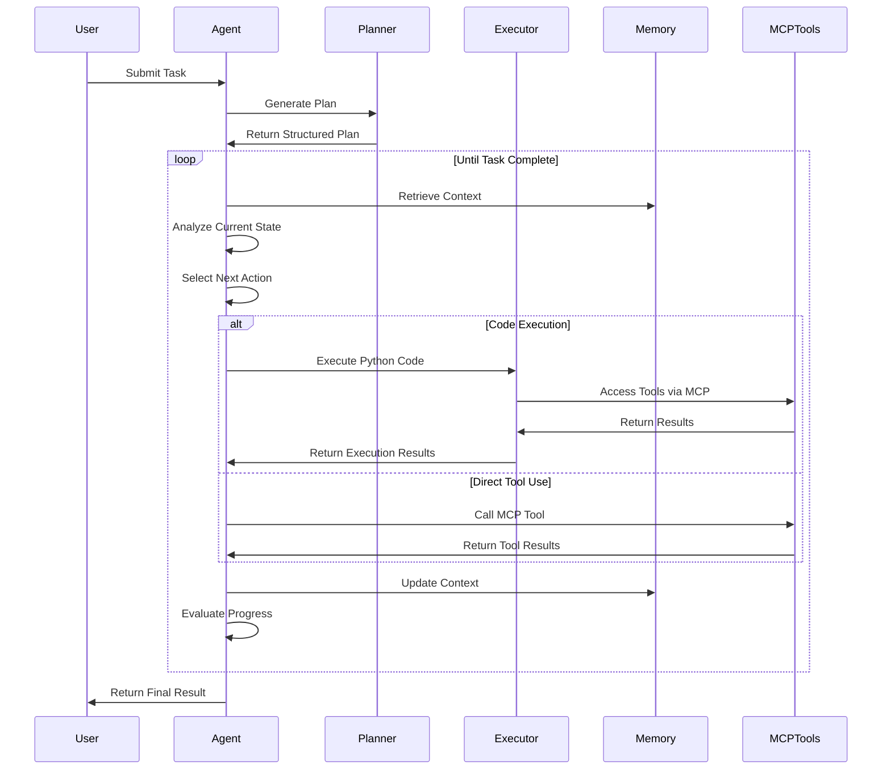

# Design Document: Creating a Manus-like Agent with MCP in LangGraph

## Overview

This design document outlines the architecture and implementation details for creating a Manus-like autonomous AI agent using the Model Context Protocol (MCP) within a LangGraph application. The agent will be capable of autonomously executing complex tasks by using a combination of foundation models, tool execution, memory management, and planning, similar to Manus.

## Background

### What is Manus?

Manus is an autonomous AI agent built as a wrapper around foundation models (primarily Claude 3.5/3.7 and Alibaba's Qwen). It operates in a cloud-based virtual computing environment with full access to tools like web browsers, shell commands, and code execution. The system's key innovation is using executable Python code as its action mechanism ("CodeAct" approach), allowing it to perform complex operations autonomously.

### Model Context Protocol (MCP)

MCP is a standardized protocol for enabling AI models to access tools, datasets, and other resources. It defines how AI applications can communicate with external services, execute commands, and interact with resources in a standardized way.

### LangGraph

LangGraph is a library for building stateful, multi-actor applications with LLMs. It provides a framework for creating complex workflows where LLMs can interact with tools, retain memory across interactions, and coordinate complex processes.

## Goals

1. Build an autonomous agent that can:
   - Execute complex tasks through a self-directed workflow
   - Use CodeAct-style execution for flexibility and power
   - Maintain context and memory across operations
   - Access and use MCP tools for environment interaction
   - Plan and reason about multi-step tasks

2. Integrate smoothly with LangGraph to enable:
   - Workflow management
   - State persistence
   - Human-in-the-loop capabilities
   - Debugging and monitoring

## Architecture Overview



### Key Components

1. **Agent Loop**: The central control system that manages the agent's execution cycle (Analyze → Plan → Execute → Observe).

2. **Memory Manager**: Handles both short-term context (current operation) and long-term memory (file-based and vector storage).

3. **Task Planner**: Breaks down complex user requests into structured steps and tracks progress.

4. **Code Executor**: Safe execution environment for Python code with access controls and isolation.

5. **Orchestrator**: Coordinates components and manages the flow of information between them.

6. **MCP Client Manager**: Establishes and maintains connections with various MCP servers.

7. **Tool Registry**: Maintains a registry of available tools from connected MCP servers.

8. **Resource Registry**: Manages access to resources provided by MCP servers.

9. **Foundation Models**: Claude 3.7 and potentially other models for reasoning and code generation.

## Implementation Details

### Core Agent Loop



### Agent State Schema

```typescript
interface AgentState {
  // Task and planning
  taskDescription: string;
  plan: {
    steps: Array<{
      number: number;
      description: string;
      status: "pending" | "in_progress" | "completed" | "failed";
    }>;
    currentStepIndex: number;
  };
  
  // Memory and context
  messages: Message[];  // Conversation history
  workingMemory: {
    fileReferences: string[];  // Paths to files in workspace
    variables: Record<string, any>;  // In-memory variables
  };
  
  // MCP integration
  activeTools: Record<string, MCPToolInfo>;
  activeResources: Record<string, MCPResourceInfo>;
  
  // CodeAct execution
  lastExecutionResult: {
    stdout: string;
    stderr: string;
    returnValue: any;
  };
  
  // System status
  status: "idle" | "planning" | "executing" | "waiting_for_human" | "error";
  error?: string;
}
```

### LangGraph State Management

We'll define our agent's state management using LangGraph's `StateGraph` with a TypedDict:

```python
from typing import TypedDict, List, Dict, Literal, Optional, Any
from typing_extensions import NotRequired
from langgraph.graph import StateGraph

class Step(TypedDict):
    number: int
    description: str
    status: Literal["pending", "in_progress", "completed", "failed"]

class Plan(TypedDict):
    steps: List[Step]
    currentStepIndex: int

class WorkingMemory(TypedDict):
    fileReferences: List[str]
    variables: Dict[str, Any]

class ExecutionResult(TypedDict):
    stdout: str
    stderr: str
    returnValue: Any

class AgentState(TypedDict):
    taskDescription: str
    plan: Plan
    messages: List[Dict[str, Any]]
    workingMemory: WorkingMemory
    activeTools: Dict[str, Dict[str, Any]]
    activeResources: Dict[str, Dict[str, Any]]
    lastExecutionResult: NotRequired[ExecutionResult]
    status: Literal["idle", "planning", "executing", "waiting_for_human", "error"]
    error: NotRequired[str]

# Create the state graph
builder = StateGraph(AgentState)
```

### Node Definitions

#### Planner Node

```python
def planner_node(state: AgentState) -> Dict:
    """Break down the user task into a structured plan."""
    messages = state["messages"]
    task = state["taskDescription"]
    
    # Prompt the LLM to create a plan
    response = llm.invoke([
        SystemMessage(content="You are a planning assistant..."),
        HumanMessage(content=f"Create a step-by-step plan for this task: {task}")
    ])
    
    # Parse the plan into structured steps
    plan = parse_plan(response.content)
    
    # Update the state
    return {
        "plan": {
            "steps": plan,
            "currentStepIndex": 0
        },
        "status": "executing"
    }
```

#### Analyzer Node

```python
def analyzer_node(state: AgentState) -> Dict:
    """Analyze the current state and determine the next action."""
    # Get current step
    current_step_idx = state["plan"]["currentStepIndex"]
    current_step = state["plan"]["steps"][current_step_idx]
    
    # Prepare context for the LLM
    messages = [
        SystemMessage(content="You are an autonomous agent..."),
        HumanMessage(content=f"Current task: {state['taskDescription']}"),
        HumanMessage(content=f"Current step: {current_step['description']}")
    ]
    
    # Add working memory for context
    for file_ref in state["workingMemory"]["fileReferences"]:
        messages.append(HumanMessage(content=f"File reference: {file_ref}"))
    
    # Add previous execution result if exists
    if "lastExecutionResult" in state:
        messages.append(HumanMessage(content=f"Last execution result: {state['lastExecutionResult']}"))
    
    # Ask LLM for next action
    response = llm.invoke(messages)
    
    # Parse the action (code or tool call)
    action = parse_action(response.content)
    
    return {
        "nextAction": action,
        "messages": state["messages"] + [{"role": "assistant", "content": response.content}]
    }
```

#### Executor Node

```python
def executor_node(state: AgentState) -> Dict:
    """Execute the action determined by the analyzer."""
    action = state["nextAction"]
    
    if action["type"] == "code":
        # Execute Python code
        result = execute_code_safely(action["code"])
        return {
            "lastExecutionResult": result,
            "status": "executing"
        }
    elif action["type"] == "tool":
        # Call an MCP tool
        tool_name = action["toolName"]
        tool_args = action["toolArgs"]
        
        if tool_name in state["activeTools"]:
            result = call_mcp_tool(tool_name, tool_args)
            return {
                "lastExecutionResult": {
                    "stdout": result,
                    "stderr": "",
                    "returnValue": result
                },
                "status": "executing"
            }
        else:
            return {
                "error": f"Tool {tool_name} not found.",
                "status": "error"
            }
    else:
        return {
            "error": f"Unknown action type: {action['type']}",
            "status": "error"
        }
```

#### Progress Evaluator Node

```python
def progress_evaluator_node(state: AgentState) -> Dict:
    """Evaluate progress and update plan status."""
    current_step_idx = state["plan"]["currentStepIndex"]
    current_step = state["plan"]["steps"][current_step_idx]
    
    # Check if the step is completed
    messages = [
        SystemMessage(content="You are an evaluation assistant..."),
        HumanMessage(content=f"Step to evaluate: {current_step['description']}"),
        HumanMessage(content=f"Execution result: {state['lastExecutionResult']}")
    ]
    
    response = llm.invoke(messages)
    is_completed = is_step_completed(response.content)
    
    updated_steps = state["plan"]["steps"].copy()
    
    if is_completed:
        # Mark current step as completed
        updated_steps[current_step_idx]["status"] = "completed"
        next_step_idx = current_step_idx + 1
        
        # Check if we've completed all steps
        if next_step_idx >= len(updated_steps):
            return {
                "plan": {
                    "steps": updated_steps,
                    "currentStepIndex": current_step_idx
                },
                "status": "idle"  # Task complete
            }
        else:
            # Move to next step
            return {
                "plan": {
                    "steps": updated_steps,
                    "currentStepIndex": next_step_idx
                },
                "status": "executing"
            }
    else:
        # Step not completed, continue execution
        return {
            "plan": {
                "steps": updated_steps,
                "currentStepIndex": current_step_idx
            },
            "status": "executing"
        }
```

### MCP Integration

The MCP integration will be handled through a dedicated manager:

```python
class MCPClientManager:
    def __init__(self):
        self.clients = {}
        self.tool_registry = {}
        self.resource_registry = {}
    
    def register_mcp_server(self, server_name, server_config):
        """Register a new MCP server."""
        # Create MCP client
        client = create_mcp_client(server_config)
        self.clients[server_name] = client
        
        # Initialize connection
        client.initialize()
        
        # Register tools
        tools = client.list_tools()
        for tool in tools.tools:
            self.tool_registry[tool.name] = {
                "server": server_name,
                "tool": tool
            }
        
        # Register resources
        resources = client.list_resources()
        for resource in resources.resources:
            self.resource_registry[resource.uri] = {
                "server": server_name,
                "resource": resource
            }
    
    def call_tool(self, tool_name, args):
        """Call an MCP tool by name."""
        if tool_name not in self.tool_registry:
            raise ValueError(f"Tool {tool_name} not found.")
        
        server_name = self.tool_registry[tool_name]["server"]
        client = self.clients[server_name]
        
        result = client.call_tool(tool_name, args)
        return result
    
    def read_resource(self, uri):
        """Read an MCP resource by URI."""
        if uri not in self.resource_registry:
            raise ValueError(f"Resource {uri} not found.")
        
        server_name = self.resource_registry[uri]["server"]
        client = self.clients[server_name]
        
        result = client.read_resource(uri)
        return result
```

### Code Execution (CodeAct)

For safe code execution, we'll use a restricted Python environment:

```python
import ast
import builtins
import contextlib
import io
import sys
from typing import Dict, Any

class RestrictedExecutor:
    def __init__(self, allowed_modules=None, workspace_dir=None):
        self.allowed_modules = allowed_modules or ["os", "sys", "json", "math", "time", "agent_tools"]
        self.workspace_dir = workspace_dir or "./"
        self.globals = self._prepare_globals()
    
    def _prepare_globals(self) -> Dict[str, Any]:
        """Prepare a restricted globals dict for code execution."""
        safe_globals = {
            "__builtins__": {
                name: getattr(builtins, name)
                for name in dir(builtins)
                if name not in ["exec", "eval", "compile", "open", "__import__"]
            },
            "print": print
        }
        
        # Add allowed modules
        for module_name in self.allowed_modules:
            try:
                module = __import__(module_name)
                safe_globals[module_name] = module
            except ImportError:
                pass
        
        return safe_globals
    
    def execute(self, code: str):
        """Execute code in a restricted environment."""
        try:
            # Validate code with AST parsing first
            ast.parse(code)
            
            # Prepare I/O capture
            stdout = io.StringIO()
            stderr = io.StringIO()
            
            # Execute code
            result = None
            with contextlib.redirect_stdout(stdout):
                with contextlib.redirect_stderr(stderr):
                    exec(code, self.globals)
                    if "result" in self.globals:
                        result = self.globals["result"]
            
            return {
                "stdout": stdout.getvalue(),
                "stderr": stderr.getvalue(),
                "returnValue": result
            }
            
        except Exception as e:
            return {
                "stdout": "",
                "stderr": str(e),
                "returnValue": None
            }
```

## Main Graph Construction

```python
# Create nodes
builder.add_node("initialize", initialize_node)
builder.add_node("planner", planner_node)
builder.add_node("analyzer", analyzer_node)
builder.add_node("executor", executor_node)
builder.add_node("progress_evaluator", progress_evaluator_node)
builder.add_node("error_handler", error_handler_node)
builder.add_node("human_intervention", human_intervention_node)

# Define edges
builder.add_edge("initialize", "planner")
builder.add_edge("planner", "analyzer")
builder.add_edge("analyzer", "executor")
builder.add_edge("executor", "progress_evaluator")

# Add conditional edges
builder.add_conditional_edges(
    "progress_evaluator",
    lambda state: state["status"],
    {
        "executing": "analyzer",
        "error": "error_handler",
        "waiting_for_human": "human_intervention",
        "idle": END  # Task complete
    }
)

builder.add_edge("error_handler", "analyzer")
builder.add_edge("human_intervention", "analyzer")

# Compile the graph
graph = builder.compile()
```

## Human-in-the-Loop Integration

For scenarios where human approval or intervention is required:

```python
def human_intervention_node(state: AgentState) -> Dict:
    """Handle human intervention requests."""
    
    # Extract the necessary information to show the user
    current_step = state["plan"]["steps"][state["plan"]["currentStepIndex"]]
    
    # Send to human interface and wait for response
    human_response = get_human_input(
        current_task=state["taskDescription"],
        current_step=current_step,
        last_execution=state.get("lastExecutionResult", None),
        messages=state["messages"]
    )
    
    if human_response["action"] == "approve":
        # Human approves the current state, continue execution
        return {
            "status": "executing",
            "messages": state["messages"] + [
                {"role": "user", "content": "Human approved continuing execution."}
            ]
        }
    elif human_response["action"] == "modify":
        # Human provides modifications
        return {
            "messages": state["messages"] + [
                {"role": "user", "content": human_response["content"]}
            ],
            "status": "executing"
        }
    elif human_response["action"] == "abort":
        # Human aborts the task
        return {
            "status": "idle",
            "error": "Task aborted by human."
        }
```

## MCP Server Configuration

We'll use a variety of MCP servers for different capabilities:

```python
MCP_SERVER_CONFIGS = {
    "filesystem": {
        "command": "npx",
        "args": ["-y", "@modelcontextprotocol/server-filesystem", "/path/to/workspace"]
    },
    "browser": {
        "command": "npx",
        "args": ["-y", "@modelcontextprotocol/server-puppeteer"]
    },
    "shell": {
        "command": "npx",
        "args": ["-y", "@modelcontextprotocol/server-shell", "--allowedCommands", "ls,cat,echo,mkdir"]
    },
    "search": {
        "command": "npx",
        "args": ["-y", "@modelcontextprotocol/server-brave-search"],
        "env": {
            "BRAVE_API_KEY": os.environ.get("BRAVE_API_KEY")
        }
    }
}
```

## Persistence Layer

To maintain state across sessions, we'll use LangGraph's persistence capabilities:

```python
from langgraph.checkpoint.sqlite import SqliteSaver

# Create a saver for persistence
checkpointer = SqliteSaver("./agent_checkpoints.db")

# Compile the graph with persistence
graph_with_persistence = builder.compile(checkpointer=checkpointer)

# Run the graph with a specific thread ID for persistence
thread_id = "user_123_task_456"
final_state = graph_with_persistence.invoke(
    {"taskDescription": "Create a data visualization from CSV data"},
    {"thread_id": thread_id}
)

# Later, resume the same thread
existing_state = checkpointer.get_state(thread_id)
```

## Memory Management

For managing memory and context windows:

```python
def manage_memory(state: AgentState) -> Dict:
    """Manage memory and context window limitations."""
    messages = state["messages"]
    
    # If messages exceed context window, summarize older messages
    if len(messages) > MAX_MESSAGES:
        # Create summary of older messages
        old_messages = messages[:-RECENT_MESSAGES_TO_KEEP]
        summary = summarize_messages(old_messages)
        
        # Replace older messages with summary
        new_messages = [{"role": "system", "content": f"Summary of previous conversation: {summary}"}]
        new_messages.extend(messages[-RECENT_MESSAGES_TO_KEEP:])
        
        return {"messages": new_messages}
    
    return {}
```

## Implementation Roadmap

### Phase 1: Core Framework
1. Implement basic LangGraph structure with state management
2. Set up MCP client integration
3. Build code execution environment
4. Implement basic planning and execution cycle

### Phase 2: MCP Integration
1. Integrate filesystem MCP server
2. Add browser and search capabilities
3. Implement shell command execution
4. Build resource registry for file-based memory

### Phase 3: Advanced Features
1. Add human-in-the-loop approval
2. Implement persistent memory
3. Build debugging and monitoring tools
4. Add error recovery mechanisms

### Phase 4: Optimization
1. Implement context window management
2. Add parallel processing for suitable tasks
3. Build caching mechanisms for tool outputs
4. Performance optimization

## Considerations and Risks

### Security Considerations
1. **Code Execution**: Carefully manage what code the agent can execute
2. **Tool Access**: Limit tool access to necessary capabilities only
3. **File Access**: Restrict file operations to dedicated workspace
4. **User Data**: Implement proper data handling practices

### Technical Challenges
1. **Context Management**: Maintaining context across complex tasks
2. **Error Recovery**: Gracefully handling errors during execution
3. **Memory Limitations**: Managing context window limitations
4. **Tool Coordination**: Effectively combining multiple MCP tool outputs

## Conclusion

This design outlines a comprehensive approach to building a Manus-like autonomous agent using LangGraph and MCP. By combining the planning and reasoning capabilities of foundation models with the structured workflow of LangGraph and the tool ecosystem of MCP, we can create a powerful agent capable of executing complex tasks autonomously.

The architecture provides:
- Structured planning and execution
- CodeAct-style flexibility
- Persistent memory
- Human oversight
- Tool integration
- Scalability

Further refinements may be needed based on specific use cases and performance requirements, but this foundation provides a solid starting point for implementing a powerful autonomous agent system. 