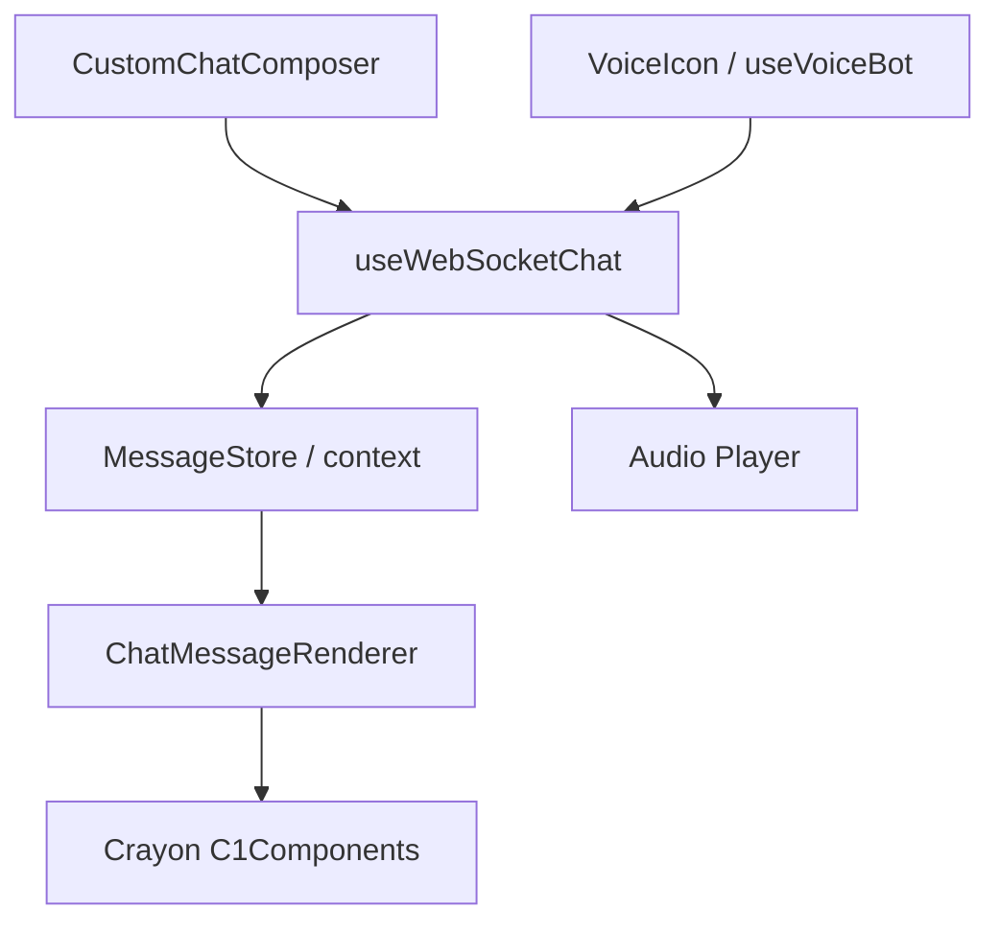
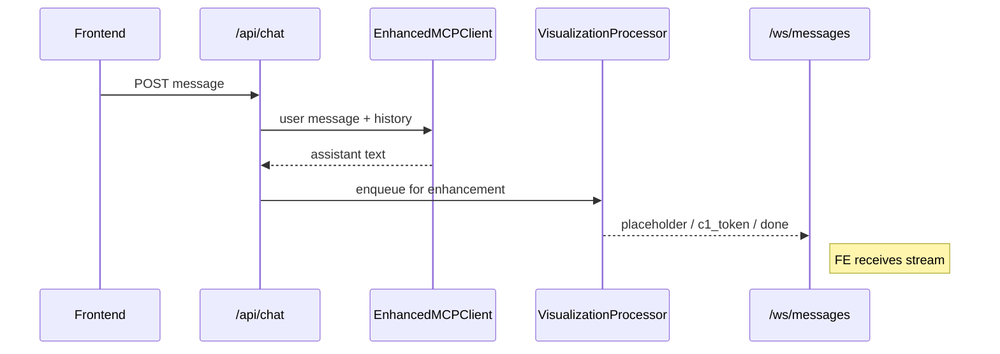
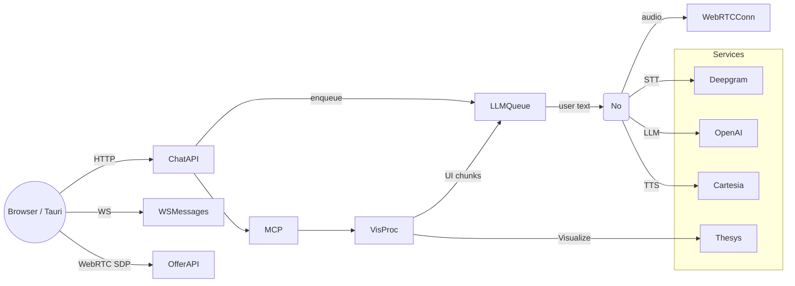
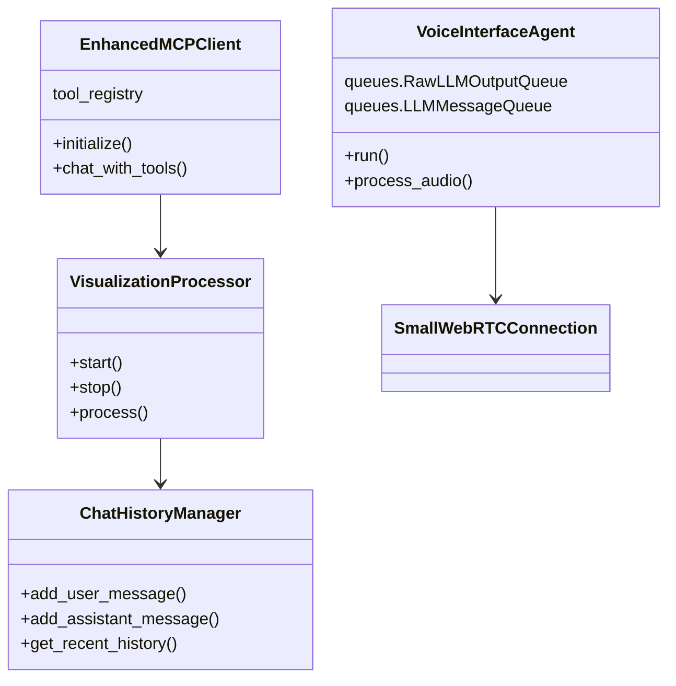

# Ada Interaction Engine – Newcomer Design Guide

> **Purpose** – This document orients new contributors to Ada’s architecture, code layout and runtime behaviour.  It is intentionally high-level; drill into the linked source files for implementation detail.

---
## Table of contents
1. [Frontend architecture](#frontend-architecture)  
2. [Backend architecture](#backend-architecture)  
3. [API Endpoints](#api-endpoints)  
4. [Diagrams](#diagrams)

---
## Frontend architecture
Ada’s desktop UI is a Tauri-wrapped React/Vite application written in TypeScript.

### Layering
| Layer | Responsibility | Key files |
|-------|----------------|-----------|
| **Presentation** | Stateless visual components: message bubbles, Crayon C1Components, icons | `src/components/*` |
| **State / Hooks** | Encapsulate side-effects and dataflow | `src/hooks/useVoiceBot.ts`, `src/hooks/useWebSocketChat.ts` |
| **Stores** | Central chat & streaming state (simple context & hooks, not Redux) | see `src/components/GenerativeUIChat.tsx` |
| **Integration** | WebRTC, WebSocket, Tauri bridge | same hooks above |

### Runtime flow
1. **User input** – text via `CustomChatComposer` or voice via `VoiceIcon` + `useVoiceBot`.  
2. **Transport** – messages sent to `/api/chat` HTTP or `/ws/messages` socket. Voice audio is transported through WebRTC negotiated by `/api/offer`.  
3. **Streaming UI** – `useWebSocketChat` merges placeholder → token → done events into the `MessageStore`; `ChatMessageRenderer` renders either plain Markdown bubbles or rich C1Components.  
4. **Audio playback** – TTS chunks arrive over the same WebRTC data channel; handled by `VoiceBotClient`.

---
## Backend architecture
Implemented as a **FastAPI** application (`backend/app`).  Lifecycle and shared resources are wired in `app/server.py`.

### Major subsystems
| Subsystem | Description | Key code |
|-----------|-------------|----------|
| **HTTP & WebSocket API** | Routers in `app/routes/chat.py` and `app/webrtc.py` | |
| **Voice Fast-Path** | `VoiceInterfaceAgent` streams Deepgram → OpenAI → Cartesia via Pipecat | `backend/agent/voice_based_interaction_agent.py` |
| **Slow UI Path** | `VisualizationProcessor` decides if response needs UI, calls Thesys Visualize | `app/vis_processor.py` |
| **MCP Tooling** | `EnhancedMCPClient` brokers external tool calls | `agent/enhanced_mcp_client_agent.py` |
| **Queues** | Non-blocking fan-out between producers & WebSocket consumers | `app/queues.py` |
| **Chat History** | Async in-memory + SQLite persistence | `app/chat_history_manager.py` |

### Request processing sequence

### Component interactions

---
## API Endpoints
| Method | Path | Purpose | Request model | Primary response |
|--------|------|---------|---------------|------------------|
| `GET` | `/health` | Liveness probe | – | `{status:"ok"}` |
| `POST` | `/api/chat` | Submit text message or C1 action | `ChatRequest` or `ThesysBridgeRequest` | `{status:"processing", thread_id}` (actual answer streams via WS) |
| `WS` | `/ws/messages` | Bidirectional chat & streaming transport | see message types below | JSON message stream |
| `POST` | `/api/offer` | WebRTC offer / renegotiation | `WebRTCOffer` | `WebRTCAnswer` (SDP) |
| `GET` | `/api/mcp/tools` | Enumerate available MCP tools | – | `{ enhanced_client:[...]}` |
| `GET` | `/api/chat/threads` | List active thread IDs *(debug)* | – | `[threadId]` |
| `GET` | `/api/chat/history/{id}` | Retrieve conversation history *(debug)* | `?max_messages=` | `[messages]` |

### WebSocket message contract
| Direction | `type` | Payload fields |
|-----------|--------|----------------|
| ▶️ client→server | `chat` | `message`, `thread_id` |
| ▶️ client→server | `c1_action` | `prompt`, `threadId` |
| ◀️ server→client | `connection_ack` | – |
| ◀️ server→client | `placeholder` | `message_id` |
| ◀️ server→client | `c1_token` | `message_id`, `chunk` |
| ◀️ server→client | `chat_done` | `message_id` |

---
## Diagrams
### 1. Combined component view
*(see above component diagrams)*

### 2. Data-flow variants
*(see sequence diagram; fast vs slow path)*

### 3. Class overview (backend core)

---
### Next steps for contributors
1. Follow `README.md` to bootstrap the stack (`poetry install`, `npm i`, `cargo tauri dev`).  
2. Start backend with `python -m backend.app.server` or `uvicorn app.server:app`.  
3. Run unit tests: `pytest -q`.  
4. Review `STREAMING_INTEGRATION_GUIDE.md` for streaming semantics before touching the protocol.

Welcome aboard, and happy hacking!
