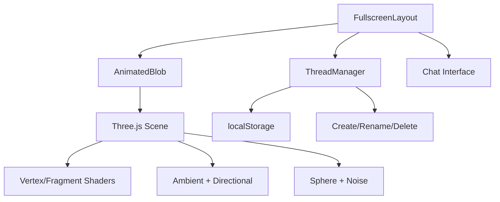
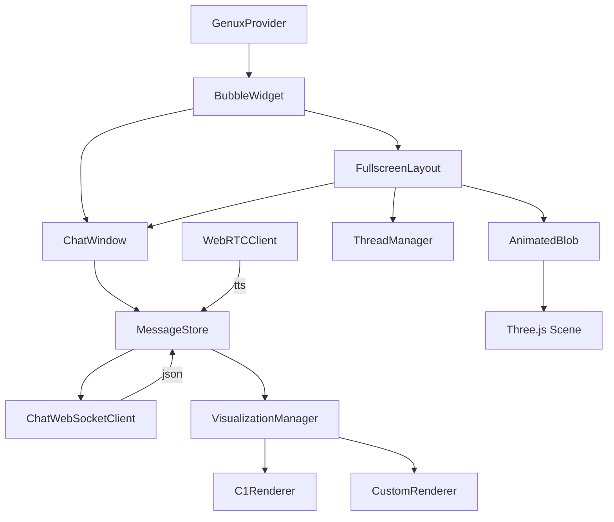
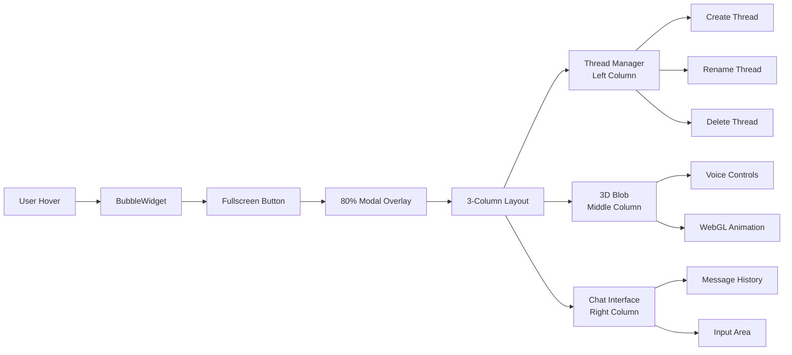
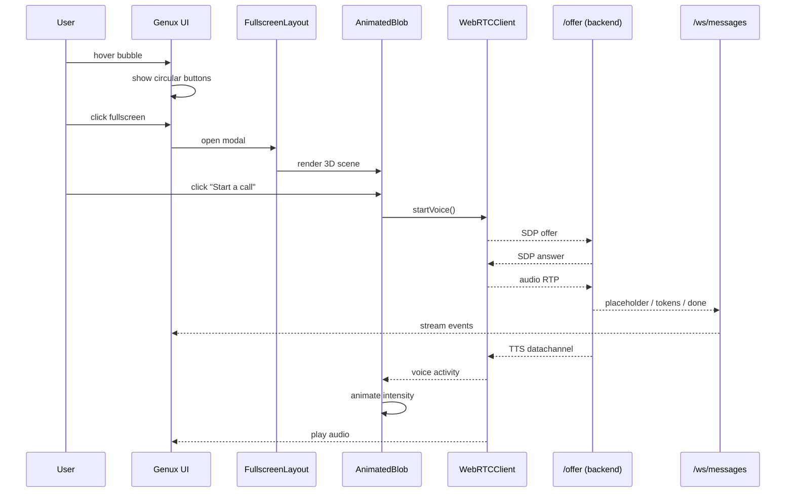
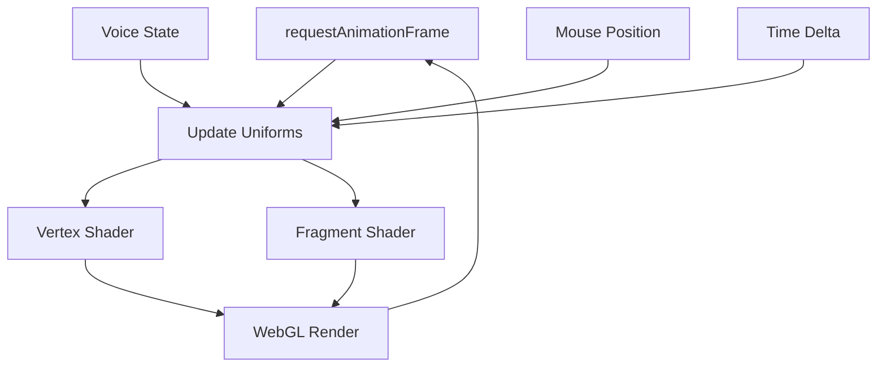

# Genux SDK – Product Requirements & Technical Design

> **Objective** — Turn Ada's interaction engine into a drop-in JS/TS SDK that SaaS vendors can embed as a chat/voice assistant (customer-service widget, onboarding coach, Siri-like voice agent).  
> This document captures product requirements and the high-level technical design (post-Tauri).

-------------------------------------------------------------------------------
## 1. Product Requirements (PRD)

### 1.1 Vision
Ship a lightweight, fully-customisable web SDK that exposes Ada's dual-path conversational capabilities via a `<Genux/>` React component.  Integration must be trivial for non-technical teams yet allow power users to override every pixel & pipeline.

### 1.2 Personas & Use-cases
| Persona | Goals | Key Needs |
|---------|-------|-----------|
| **CX SaaS integrator** | Embed support chatbot on *any* customer site in minutes | Minimal code, brandable widget, CSAT metrics |
| **Product-led onboarding tool** | Deliver interactive onboarding tours | Fine-grained control over UI themes, can drive in-app events |
| **Power developer** ("Siri competitor") | Build bespoke voice interface on devices | Headless API, low-latency WebRTC hooks |

### 1.3 Scope – MVP (✅ **COMPLETED**)
1. `npm i genux`  
   `<Genux webrtcURL="…/offer" websocketURL="…/ws/messages" bubbleEnabled={true} showThreadManager={false} allowFullScreen={true}/>` renders a floating button which pops a default chat+voice panel. If bubbleEnabled is False, it'll just render the detailed chat button. 
2. Config API exposing:  
   • `visualization.provider`: *default* (C1), *custom*, *none*  
   • `designSystem`: *default*, *shadcn* (only with custom viz)  
   • `theme`: CSS-in-JS token map or Tailwind class prefix  
   • `bubbleEnabled`: If bubbleEnabled is false it'll renders a floating button which pops a default chat+voice panel, it'll just render the detailed chat button.  
   • `showThreadManager`: Will decide if we will show collapseable left bar.  
   • **`allowFullScreen`**: ✅ **NEW** - Enables fullscreen mode with 3-column immersive layout. Consuming app must import `FullscreenLayout.css` (from `genux-sdk/dist` or `src/components`) so the grid and glass morphism styles are applied.

3. When `bubbleEnabled === true` the widget must exhibit the following behaviour:  
   - Fixed to the **right-centre** of the viewport (`top:50% ; right:30px ; transform:translateY(-50%)`).  
   - **Hover** reveals a **circular arrangement** of controls: ✅ **ENHANCED**
     1. *Chat* icon (top) → opens full-height chat view with composer drawer.  
     2. *Fullscreen* icon (left) → opens immersive 3-column fullscreen mode ✅ **NEW**
     3. *Mic toggle* (bottom) → mutes/unmutes voice input.  
   - Chat view can be **minimised** back to bubble state via a close/minimise button.  
   - All positions, icons and animations must be themable via exposed tokens or overrides.
   - **Bubble & panel are draggable** across the viewport; on drag-end snap to nearest screen edge.  
     • Reference implementation will wrap the button & window with [`react-draggable`](https://www.npmjs.com/package/react-draggable) (~6 kB gz).  
     • Draggable area includes the three-dots "handle" shown in mock-ups.

4. **✅ NEW: Fullscreen Immersive Mode**
   - **3-Column Layout**: Left (collapsible thread manager) | Middle (3D blob + agent branding) | Right (chat interface)
   - **Animated 3D Blob**: Three.js-powered sphere with noise-based vertex displacement, voice-reactive animations, mouse interactions
   - **11ai-Style Interface**: Overlay button on blob for "Start a call" functionality with configurable text
   - **Thread Management**: Create, rename, delete conversations with real-time persistence
   - **Agent Branding**: Configurable agent name, subtitle, logo, and color scheme
   - **Modal Overlay**: 80% screen coverage with backdrop click to close and dedicated close button
   - **Glass Morphism Design**: Modern blur effects and translucent interfaces
   - **Responsive Layout**: Adapts to different screen sizes with mobile optimizations

5. Ship default Crayon C1Component renderer with progressive streaming.
6. Headless hooks (`useGenuxClient`) so advanced users can supply their own React tree.
7. **✅ ENHANCED: Component Override System** - Complete customization of any UI component
8. Bundle size ≤ **100 kB** gzipped.
9. No Tauri/native dependencies; pure browser (ESM + CJS builds).

### 1.4 Future (out-of-scope for MVP)
- Offline ASR/TTS fallbacks
- Native mobile wrappers
- Analytics dashboard
- **Advanced 3D visualizations** (particle systems, audio visualizers)
- **VR/AR integration** for immersive experiences

### 1.5 Functional Requirements
| # | Requirement |
|---|-------------|
| F-1 | Must connect to backend via configurable **WebRTC** & **WebSocket** endpoints. |
| F-2 | Provide default floating **ChatButton** and **ChatWindow** UI with voice support. |
| F-3 | Support **C1Component** streaming out-of-the-box. |
| F-4 | Allow integrator to switch to **custom visualisation** via render callback or component map. |
| F-5 | Expose **headless hooks / context** so integrator can build fully custom UI. |
| F-6 | Themeable via design-system tokens; works with default CSS vars or **shadcn** slot classes. |
| F-7 | Allow passing additional **MCP endpoints** that propagate to backend through metadata. |
| F-8 | Provide TypeScript typings for all public APIs. |
| F-9 | Graceful degradation if browser lacks mic/cam permissions – fall back to text only. |
| **F-10** | Bubble button and expanded chat panel must be **draggable** (mouse & touch). Default implementation uses `react-draggable`; behaviour can be overridden. |
| **✅ F-11** | **Fullscreen immersive mode** with 3-column layout and 3D animated interface elements. |
| **✅ F-12** | **Complete component override system** allowing replacement of any UI element. |
| **✅ F-13** | **Circular button arrangement** on bubble hover with configurable positioning. |
| **✅ F-14** | **Thread management** with persistence, creation, deletion, and renaming capabilities. |
| **✅ F-15** | **Voice-reactive 3D animations** that respond to audio input and connection states. |
| **F-16** | Consuming app must import `FullscreenLayout.css` to enable grid and glass-morphism styles for fullscreen mode. |

### 1.6 Non-Functional Requirements
| Category | Target |
|----------|--------|
| **Performance** | Placeholder latency ≤ 200 ms (P95) from send() to first token |
| **Size** | Core bundle ≤ 100 kB gz (ESM) |
| **Accessibility** | WCAG 2.1 AA, proper ARIA roles |
| **Browser support** | Evergreen Chrome, Edge, Firefox, Safari ≥ 2022, iOS 15+ |
| **Security** | All network via wss/https; CSP-safe; no localStorage secrets |
| **Internationalisation** | UTF-8 throughout; expose locale prop for future prompts |
| **✅ Animation Performance** | 60fps 3D animations; smooth WebGL rendering on mid-range devices |
| **✅ Mobile Responsiveness** | Fullscreen mode adapts to mobile viewports; touch-friendly controls |

### 1.7 Success Metrics
- **Time-to-First-Message**: ‹ 5 min for new integrator (tracked via sample app)
- **Widget Conversion**: ≥ 30 % of page visitors open Genux button (CX SaaS)
- **Bundle Size**: ‹ 100 kB gz in CI size-tracking job
- **✅ Fullscreen Adoption**: ≥ 15% of interactions use fullscreen mode
- **✅ Customization Usage**: ≥ 40% of integrations override at least one component

### 1.8 Open Questions / Risks
1. How are additional MCP endpoints authenticated cross-origin?  
2. Should we upstream voice activity detection to client to reduce audio Tx?  
3. Will shadcn class collision occur inside host apps? (use CSS modules?)  
4. **✅ Three.js Bundle Impact**: Does WebGL dependency affect load times on low-end devices?
5. **✅ Mobile WebGL Support**: How well do 3D animations perform on older mobile browsers?

-------------------------------------------------------------------------------
## 2. Technical Design

### 2.1 High-level Architecture
```mermaid
graph LR
  subgraph SDK (browser)
    GenuxProvider -->|props| Config
    ChatButton --> ChatWindow
    ChatButton --> FullscreenLayout
    FullscreenLayout --> AnimatedBlob
    FullscreenLayout --> ThreadManager
    ChatWindow --> UIRenderer
    UIRenderer -->|custom| VisualizationManager
    UIRenderer -->|default| C1Renderer
    ChatWindow --> VoicePlayer
    ChatWindow --> MessageStore
    MessageStore --> ConnectionService
    AnimatedBlob --> ThreeJSRenderer
  end

  subgraph ConnectionService
     WebRTCClient
     ChatWSClient
  end

  ConnectionService --> Backend[(Ada Backend)]
```

### 2.2 Package Layout
```
packages/
  genux-sdk/
    src/
      index.ts                     # public re-exports
      components/
        Genux.tsx                   # main component
        BubbleWidget.tsx          # enhanced circular button layout
        ChatButton.tsx
        ChatWindow.tsx
        FullscreenLayout.tsx      # ✅ NEW: 3-column fullscreen layout
        FullscreenLayout.css      # ✅ NEW: glass morphism styling
        AnimatedBlob.tsx          # ✅ NEW: Three.js 3D blob
        ThreadManager.tsx         # enhanced thread management
        CustomChatMessage.tsx
        CustomChatComposer.tsx
        defaults/                 # default implementations
      hooks/{useGenuxClient,useThreadManager}.ts
      core/ConnectionService.ts
      core/WebRTCClient.ts
      core/ChatWebSocketClient.ts
      core/VisualizationManager.ts
      renderers/{C1Renderer,CustomRenderer}.tsx
      theming/{defaultTheme,shadcnTheme}.ts
      types/index.ts            # ✅ ENHANCED: fullscreen types
    dist/  (esm + cjs + d.ts)
```

### 2.3 Public API (TypeScript)
```ts
export interface GenuxProps {
  webrtcURL: string;
  websocketURL: string;
  bubbleEnabled?: boolean;
  showThreadManager?: boolean;
  allowFullScreen?: boolean;        // ✅ NEW
  options?: GenuxOptions;
}

export interface GenuxOptions {
  visualization?: {
    provider: 'default' | 'custom' | 'none';
    render?: (msg: AssistantMessage, ctx: VisContext) => React.ReactNode;
  };
  designSystem?: 'default' | 'shadcn';
  theme?: Partial<ThemeTokens>;
  mcpEndpoints?: { name: string; url: string; apiKey?: string }[];
  components?: Partial<ComponentOverrides>;
  
  // ✅ NEW: Agent & Fullscreen Configuration
  agentName?: string;
  agentSubtitle?: string;          // ✅ NEW
  logoUrl?: string;
  backgroundColor?: string;        // ✅ NEW
  primaryColor?: string;          // ✅ NEW
  accentColor?: string;           // ✅ NEW
  threadManagerTitle?: string;    // ✅ NEW
  enableThreadManager?: boolean;  // ✅ NEW
  startCallButtonText?: string;   // ✅ NEW
  endCallButtonText?: string;     // ✅ NEW
  connectingText?: string;        // ✅ NEW
  
  threadManager?: {
    enablePersistence?: boolean;
    storageKey?: string;
    maxThreads?: number;
    autoGenerateTitles?: boolean;
    showCreateButton?: boolean;
    allowThreadDeletion?: boolean;
    initiallyCollapsed?: boolean;
  };
}

export const Genux: React.FC<GenuxProps>;

// ✅ NEW: Fullscreen Components
export const FullscreenLayout: React.FC<FullscreenLayoutProps>;
export const AnimatedBlob: React.FC<AnimatedBlobProps>;

// ✅ NEW: Configuration Types
export interface FullscreenLayoutConfig {
  agentName?: string;
  agentSubtitle?: string;
  logoUrl?: string;
  backgroundColor?: string;
  primaryColor?: string;
  accentColor?: string;
  threadManagerTitle?: string;
  enableThreadManager?: boolean;
  startCallButtonText?: string;
  endCallButtonText?: string;
  connectingText?: string;
}

/** Headless hook */
export function useGenuxClient(): {
  sendText(msg: string): void;
  startVoice(): void;
  stopVoice(): void;
  messages: Message[];
  connectionState: 'connected' | 'connecting' | 'error';
  voiceState: 'connected' | 'connecting' | 'disconnected';  // ✅ ENHANCED
};
```

### 2.4 Default UI Flow
1. **BubbleWidget** sits fixed at right-center with **circular button arrangement** on hover.
2. **Chat button** renders **ChatWindow** overlay.
3. **✅ NEW: Fullscreen button** renders **FullscreenLayout** with 3-column design.
4. **FullscreenLayout** contains **AnimatedBlob** (Three.js), **ThreadManager**, and chat interface.
5. **AnimatedBlob** responds to voice state with vertex shader animations.
6. **ThreadManager** handles conversation persistence and management.
7. **C1Renderer** converts streaming events into Crayon components.
8. **VoicePlayer** receives TTS chunks via WebRTC and plays via Web Audio API.

### 2.5 Customisation Strategy
| Layer | Default | Override mechanism |
|-------|---------|--------------------|
| Network | WebRTC/WS clients | Provide own URLs or extend `ConnectionService` |
| UI | ChatButton/ChatWindow/FullscreenLayout | `components` prop or build from **useGenuxClient** headless hooks |
| 3D Graphics | AnimatedBlob (Three.js) | Replace `AnimatedBlob` component or disable fullscreen |
| Visualization | C1Renderer | `visualization.render` callback or disable |
| Design system | CSS vars + glass morphism | `designSystem='shadcn'` imports shadcn primitives |
| Theme | defaultTheme + fullscreen colors | `theme` tokens + fullscreen config (deep-merge) |
| **Drag behaviour** | `react-draggable` wrapper | Supply custom `DraggableWrapper` via `components` overrides |

*Rationale*: Ship **both** – high-level overrides *and* low-level hooks – to satisfy beginners and power users.

### 2.6 ✅ NEW: Fullscreen Layout Architecture


### 2.7 ✅ NEW: Animation System
- **Three.js WebGL Renderer** with alpha transparency
- **Noise-based vertex displacement** using simplex noise
- **Voice-reactive uniforms**: intensity and activity based on audio state
- **Mouse interaction effects** with position-based displacement
- **Gentle rotation animation** with time-based transforms
- **Responsive canvas sizing** with automatic aspect ratio adjustment

### 2.8 Connection Layer
- **ChatWebSocketClient** – maintains WS, reconnect with back-off, multiplexes streams.
- **WebRTCClient** – negotiates offer/answer; publishes mic track; handles incoming TTS data channel.
- **ConnectionService** – facade exposing `sendText`, `startVoice`, emits message/tts events.

### 2.9 Removing Tauri
All Tauri-specific modules (window controls, fs access) are deleted.  
Audio capture uses `navigator.mediaDevices.getUserMedia`; desktop packaging left to downstream consumers.

### 2.10 Build & Release
- **Monorepo** with pnpm workspaces.
- Bundle via **tsup** (esbuild) → ESM & CJS, d.ts.
- CI size-limit check (`size-limit`).
- Publish to npm with `next` & `latest` tags.

### 2.11 Security & Compliance
- All remote URLs must be HTTPS/WSS.
- No secrets stored client-side; MCP API keys *optional* and may be short-lived.
- WebRTC uses `autoGainControl:false`, etc., to avoid leaking headphone audio.
- **✅ WebGL Security**: Three.js renderer uses standard context without extensions.

-------------------------------------------------------------------------------
## 3. Diagrams

### 3.1 ✅ ENHANCED: SDK Component Diagram


### 3.2 ✅ NEW: Fullscreen Layout Flow


### 3.3 Data-flow Sequence (Voice + Fullscreen)


### 3.4 ✅ NEW: Three.js Animation Pipeline


-------------------------------------------------------------------------------
## 4. Implementation Plan & Milestones
| Week | Deliverable | Status |
|------|-------------|--------|
| 1 | Repo split, remove Tauri, set up build pipeline | ✅ **Done** |
| 2 | ConnectionService, WebSocket + WebRTC clients (unit-tested) | ✅ **Done** |
| 3 | Headless hooks + MessageStore | ✅ **Done** |
| 4 | Default UI (button + window) + theming | ✅ **Done** |
| 5 | VisualizationManager with C1Renderer | ✅ **Done** |
| 6 | Custom provider API + shadcn integration | ✅ **Done** |
| 7 | **✅ Component override system** | ✅ **Done** |
| 8 | **✅ Enhanced thread management** | ✅ **Done** |
| 9 | **✅ Circular bubble button layout** | ✅ **Done** |
| 10 | **✅ Three.js AnimatedBlob component** | ✅ **Done** |
| 11 | **✅ FullscreenLayout 3-column design** | ✅ **Done** |
| 12 | **✅ Glass morphism styling & animations** | ✅ **Done** |
| 13 | Example apps: *vanilla embed*, *custom UI*, *fullscreen mode* | 🔄 **In Progress** |
| 14 | Docs update + npm publish, size + perf audit | 🔄 **In Progress** |

-------------------------------------------------------------------------------
## 5. Appendix
- **Ada backend compatibility**: requires `/api/offer` & `/ws/messages` unchanged.  
- **Naming rationale**: *Genux* = smart talking bird ➜ conversational assistant.  
- **License**: MIT for SDK; enterprise licence for backend.
- **✅ Three.js Integration**: Uses standard geometry and shaders; no external model dependencies.
- **✅ Performance Considerations**: WebGL context uses power-preference="high-performance" for smooth animations.

## 6. ✅ NEW: Fullscreen Mode Specifications

### 6.1 Layout Specifications
```css
.fullscreen-layout {
  display: grid;
  grid-template-columns: auto 1fr 400px;  /* Thread | Blob | Chat */
  height: 100vh;
  width: 100vw;
}

.thread-manager-column.collapsed { width: 60px; }
.thread-manager-column.expanded { width: 300px; }
```

### 6.2 3D Blob Specifications
- **Geometry**: `THREE.SphereGeometry(1.5, 32, 32)`
- **Material**: Custom `ShaderMaterial` with noise displacement
- **Animation**: 60fps requestAnimationFrame loop
- **Voice Integration**: Uniforms react to `isVoiceConnected` and `isVoiceLoading`
- **Interaction**: Mouse position affects vertex displacement

### 6.3 Thread Manager Specifications
- **Persistence**: localStorage with configurable key
- **Operations**: Create, rename, delete conversations
- **UI States**: Collapsed (60px) vs Expanded (300px)
- **Real-time**: Instant thread switching and updates

### 6.4 Responsive Breakpoints
```css
@media (max-width: 1200px) {
  .fullscreen-layout { grid-template-columns: auto 1fr 350px; }
}

@media (max-width: 768px) {
  .fullscreen-layout { grid-template-columns: auto 1fr; }
  .chat-column { display: none; }
}
```
