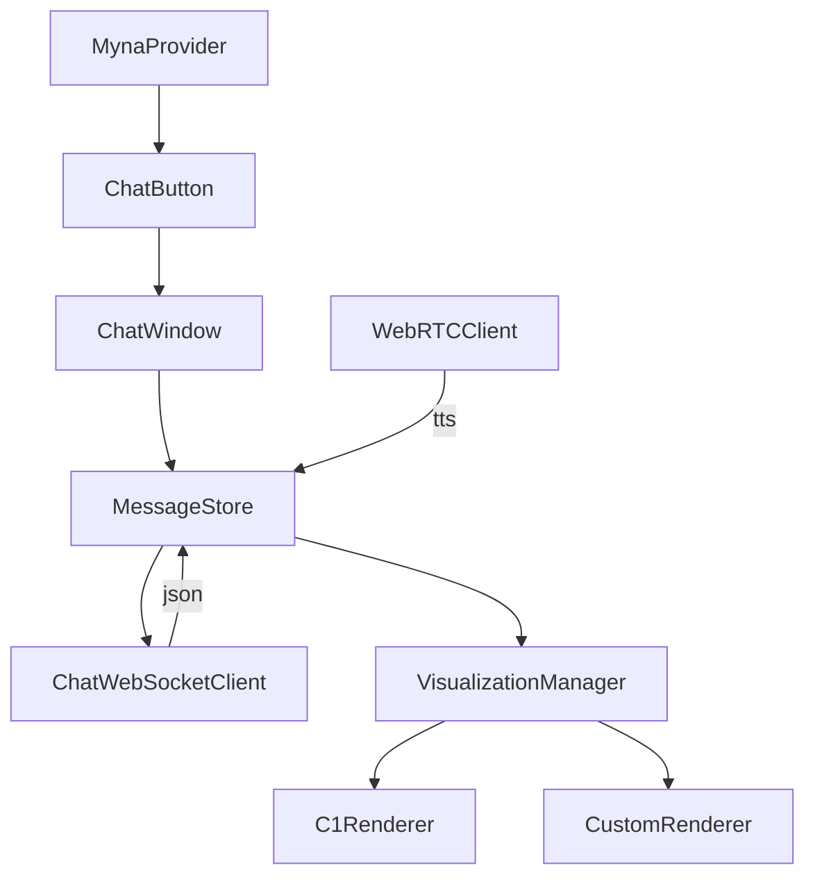
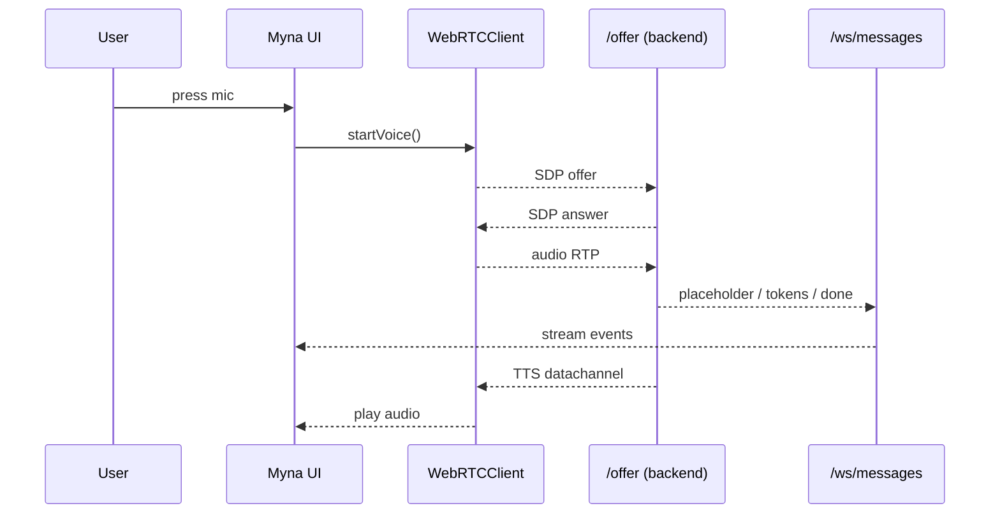
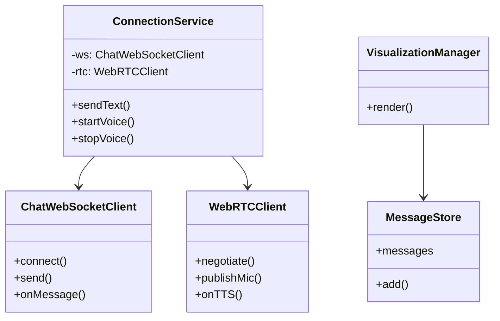

# Myna SDK – Product Requirements & Technical Design

> **Objective** — Turn Ada’s interaction engine into a drop-in JS/TS SDK that SaaS vendors can embed as a chat/voice assistant (customer-service widget, onboarding coach, Siri-like voice agent).  
> This document captures product requirements and the high-level technical design (post-Tauri).

-------------------------------------------------------------------------------
## 1. Product Requirements (PRD)

### 1.1 Vision
Ship a lightweight, fully-customisable web SDK that exposes Ada’s dual-path conversational capabilities via a `<Myna/>` React component.  Integration must be trivial for non-technical teams yet allow power users to override every pixel & pipeline.

### 1.2 Personas & Use-cases
| Persona | Goals | Key Needs |
|---------|-------|-----------|
| **CX SaaS integrator** | Embed support chatbot on *any* customer site in minutes | Minimal code, brandable widget, CSAT metrics |
| **Product-led onboarding tool** | Deliver interactive onboarding tours | Fine-grained control over UI themes, can drive in-app events |
| **Power developer** (“Siri competitor”) | Build bespoke voice interface on devices | Headless API, low-latency WebRTC hooks |

### 1.3 Scope – MVP
1. `npm i myna`  
   `<Myna webrtcURL="…/offer" websocketURL="…/ws/messages" bubbleEnabled = true showThreadManager = False/>` renders a floating button which pops a default chat+voice panel. If bubbleEnabled is False, it'll just render the detailed chat button. 
2. Config API exposing:  
   • `visualization.provider`: *default* (C1), *custom*, *none*  
   • `designSystem`: *default*, *shadcn* (only with custom viz)  
   • `theme`: CSS-in-JS token map or Tailwind class prefix  
   • `bubbleEnabled`: If bubbleEnabled is false it'll renders a floating button which pops a default chat+voice panel, it'll just render the detailed chat button. 
   • `showThreadManager`: Will decide if we will show collapseable left bar. 

3. Ship default Crayon C1Component renderer with progressive streaming.
4. Headless hooks (`useMynaClient`) so advanced users can supply their own React tree.
5. Bundle size ≤ **100 kB** gzipped.
6. No Tauri/native dependencies; pure browser (ESM + CJS builds).

### 1.4 Future (out-of-scope for MVP)
- Offline ASR/TTS fallbacks
- Native mobile wrappers
- Analytics dashboard

### 1.5 Functional Requirements
| # | Requirement |
|---|-------------|
| F-1 | Must connect to backend via configurable **WebRTC** & **WebSocket** endpoints. |
| F-2 | Provide default floating **ChatButton** and **ChatWindow** UI with voice support. |
| F-3 | Support **C1Component** streaming out-of-the-box. |
| F-4 | Allow integrator to switch to **custom visualisation** via render callback or component map. |
| F-5 | Expose **headless hooks / context** so integrator can build fully custom UI. |
| F-6 | Themeable via design-system tokens; works with default CSS vars or **shadcn** slot classes. |
| F-7 | Allow passing additional **MCP endpoints** that propagate to backend through metadata. |
| F-8 | Provide TypeScript typings for all public APIs. |
| F-9 | Graceful degradation if browser lacks mic/cam permissions – fall back to text only. |

### 1.6 Non-Functional Requirements
| Category | Target |
|----------|--------|
| **Performance** | Placeholder latency ≤ 200 ms (P95) from send() to first token |
| **Size** | Core bundle ≤ 100 kB gz (ESM) |
| **Accessibility** | WCAG 2.1 AA, proper ARIA roles |
| **Browser support** | Evergreen Chrome, Edge, Firefox, Safari ≥ 2022, iOS 15+ |
| **Security** | All network via wss/https; CSP-safe; no localStorage secrets |
| **Internationalisation** | UTF-8 throughout; expose locale prop for future prompts |

### 1.7 Success Metrics
- **Time-to-First-Message**: ‹ 5 min for new integrator (tracked via sample app)
- **Widget Conversion**: ≥ 30 % of page visitors open Myna button (CX SaaS)
- **Bundle Size**: ‹ 100 kB gz in CI size-tracking job

### 1.8 Open Questions / Risks
1. How are additional MCP endpoints authenticated cross-origin?  
2. Should we upstream voice activity detection to client to reduce audio Tx?  
3. Will shadcn class collision occur inside host apps? (use CSS modules?)  

-------------------------------------------------------------------------------
## 2. Technical Design

### 2.1 High-level Architecture
```mermaid
graph LR
  subgraph SDK (browser)
    MynaProvider -->|props| Config
    ChatButton --> ChatWindow
    ChatWindow --> UIRenderer
    UIRenderer -->|custom| VisualizationManager
    UIRenderer -->|default| C1Renderer
    ChatWindow --> VoicePlayer
    ChatWindow --> MessageStore
    MessageStore --> ConnectionService
  end

  subgraph ConnectionService
     WebRTCClient
     ChatWSClient
  end

  ConnectionService --> Backend[(Ada Backend)]
```

### 2.2 Package Layout
```
packages/
  myna-sdk/
    src/
      index.ts                     # public re-exports
      provider/MynaProvider.tsx
      components/{ChatButton,ChatWindow,...}.tsx
      hooks/{useMynaClient,useMessageStore}.ts
      core/ConnectionService.ts
      core/WebRTCClient.ts
      core/ChatWebSocketClient.ts
      core/VisualizationManager.ts
      renderers/{C1Renderer,CustomRenderer}.tsx
      theming/{defaultTheme,shadcnTheme}.ts
    dist/  (esm + cjs + d.ts)
```

### 2.3 Public API (TypeScript)
```ts
export interface MynaProps {
  webrtcURL: string;
  websocketURL: string;
  options?: {
    visualization?: {
      provider: 'default' | 'custom' | 'none';
      /** Only when provider === 'custom' */
      render?: (msg: AssistantMessage, ctx: VisContext) => React.ReactNode;
    };
    designSystem?: 'default' | 'shadcn';
    theme?: Partial<ThemeTokens>;
    mcpEndpoints?: { name: string; url: string; apiKey?: string }[];
    /** high-level component overrides */
    components?: Partial<DefaultComponentMap>;
  };
}

export const Myna: React.FC<MynaProps>;

/** Headless hook */
export function useMynaClient(): {
  sendText(msg: string): void;
  startVoice(): void;
  stopVoice(): void;
  messages: Message[];
  connectionState: 'connected' | 'connecting' | 'error';
};
```

### 2.4 Default UI Flow
1. **ChatButton** sits fixed at bottom-right (`position: fixed; bottom:24px; right:24px`).
2. On click, renders **ChatWindow** overlay.
3. ChatWindow uses **MessageStore** (Zustand) to iterate through messages.
4. **C1Renderer** converts streaming placeholder/c1_token/done events into Crayon components.
5. **VoicePlayer** receives TTS chunks via WebRTC data channel and plays via Web Audio API.

### 2.5 Customisation Strategy
| Layer | Default | Override mechanism |
|-------|---------|--------------------|
| Network | WebRTC/WS clients | Provide own URLs or extend `ConnectionService` |
| UI | ChatButton/ChatWindow | `components` prop or build from **useMynaClient** headless hooks |
| Visualization | C1Renderer | `visualization.render` callback or disable |
| Design system | CSS vars | `designSystem='shadcn'` imports shadcn primitives |
| Theme | defaultTheme | `theme` tokens (deep-merge) |

*Rationale*: Ship **both** – high-level overrides *and* low-level hooks – to satisfy beginners and power users.

### 2.6 Visualization Provider Interface
```ts
export interface VisualizationProvider {
  render(msg: AssistantMessage, history: Message[]): React.ReactNode;
}
```
`VisualizationManager` selects provider at runtime:
```ts
const provider = opts.provider === 'custom' && opts.render
  ? { render: opts.render }
  : opts.provider === 'none'
  ? null
  : new C1Renderer();
```

### 2.7 Connection Layer
- **ChatWebSocketClient** – maintains WS, reconnect with back-off, multiplexes streams.
- **WebRTCClient** – negotiates offer/answer; publishes mic track; handles incoming TTS data channel.
- **ConnectionService** – facade exposing `sendText`, `startVoice`, emits message/tts events.

### 2.8 Removing Tauri
All Tauri-specific modules (window controls, fs access) are deleted.  
Audio capture uses `navigator.mediaDevices.getUserMedia`; desktop packaging left to downstream consumers.

### 2.9 Build & Release
- **Monorepo** with pnpm workspaces.
- Bundle via **tsup** (esbuild) → ESM & CJS, d.ts.
- CI size-limit check (`size-limit`).
- Publish to npm with `next` & `latest` tags.

### 2.10 Security & Compliance
- All remote URLs must be HTTPS/WSS.
- No secrets stored client-side; MCP API keys *optional* and may be short-lived.
- WebRTC uses `autoGainControl:false`, etc., to avoid leaking headphone audio.

-------------------------------------------------------------------------------
## 3. Diagrams

### 3.1 SDK Component Diagram


### 3.2 Data-flow Sequence (Voice)


### 3.3 Class Outline


-------------------------------------------------------------------------------
## 4. Implementation Plan & Milestones
| Week | Deliverable |
|------|-------------|
| 1 | Repo split, remove Tauri, set up build pipeline |
| 2 | ConnectionService, WebSocket + WebRTC clients (unit-tested) |
| 3 | Headless hooks + MessageStore |
| 4 | Default UI (button + window) + theming |
| 5 | VisualizationManager with C1Renderer |
| 6 | Custom provider API + shadcn integration |
| 7 | Example apps: *vanilla embed*, *custom UI*, *Siri voice* |
| 8 | Docs + npm publish, size + perf audit |

-------------------------------------------------------------------------------
## 5. Appendix
- **Ada backend compatibility**: requires `/api/offer` & `/ws/messages` unchanged.  
- **Naming rationale**: *Myna* = smart talking bird ➜ conversational assistant.  
- **License**: MIT for SDK; enterprise licence for backend.  
