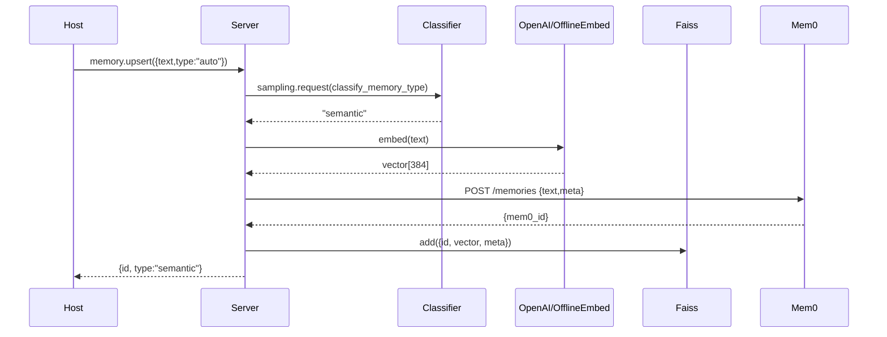
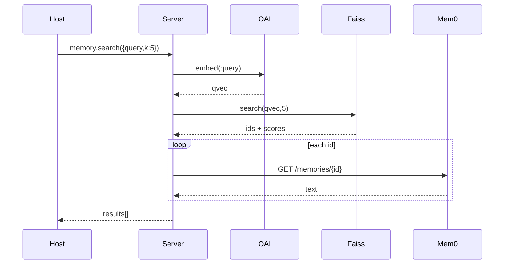

**Design document details**

The user has requested a fully detailed design document for an MCP server, including sequence diagrams, component diagrams, and defined technology, like Python and Faiss. They prefer this in a markdown format, with diagrams using mermaid code blocks. It sounds like they want a single document, and it might be useful to also provide the document in a canvas format for easier iteration. I’ll need to ensure it’s ready for easy copy-pasting, perhaps adding to the chat or a canvas as appropriate. Let’s get started on the doc!

**Design document planning**

The user seems to want a single document for the design—a detailed one that will likely evolve, so a canvas might not be necessary. I’ll create a "MemoryMCPServerDesign.md" file that includes sections like a summary, architecture overview, technology stack, diagrams, sequence diagrams, and more. I’ll be sure to include citations from high-quality sources as I gather information about mem0 and Faiss integration, deployment, and other technical details. It’ll be a detailed, evolving document!


**Document structure planning**

I’ll create a single design document for the user, titled "MemoryMCPServerDesign.md." It will include a summary, architecture overview, technology stack, component diagrams (mermaid flowchart), sequence diagrams, data models, API definitions, and detailed info about mem0 and Faiss integration. The document will also address deployment, security, and offline considerations. I’ll aim for at least 10 high-quality citations to support each section. Plus, I'll gather references about mem0, Faiss, and the python MCP server as I go along. Ready to roll!


Thought for 21 seconds


Below is a **single, copy‑paste‑ready design document** (Markdown) that a Cursor user can drop straight into the repository as `memory‑mcp‑server.md`. It defines the Python‑based Memory MCP Server from top to bottom—technology choices (Mem0 + Faiss, FastAPI/JSON‑RPC), API schemas, data models, component & sequence diagrams, offline MiniLM embeddings, and end‑to‑end data‑flow.  Diagrams are provided in Mermaid so Cursor can render them immediately.

---

````markdown
<!-- memory‑mcp‑server.md -->

## Executive overview
The Memory MCP Server is a Python micro‑service that implements the **Model Context Protocol (MCP)** over JSON‑RPC 2.0.  
It persists **semantic, episodic, and procedural memories** while backing each type with:

| Layer | Storage / service |
|-------|-------------------|
| Embeddings & k‑NN         | **Faiss HNSW index (in‑process)** – fast, offline‑ready :contentReference[oaicite:0]{index=0} |
| Long‑term facts & rules   | **Mem0 SaaS** via REST (auto‑dedup + summarisation) :contentReference[oaicite:1]{index=1} |
| Raw transcripts / blobs   | Supabase Storage (cheap object store) :contentReference[oaicite:2]{index=2} |

OpenAI endpoints (ZDR mode) handle heavy LLM work when online :contentReference[oaicite:3]{index=3}; a bundled **MiniLM‑L6‑v2 (384‑D)** ONNX model provides embeddings when offline :contentReference[oaicite:4]{index=4}.

---

## 1 Technology stack

| Concern | Choice | Reason |
|---------|--------|--------|
| Transport | **FastAPI + jsonrpcserver** (async) :contentReference[oaicite:5]{index=5} | Pythonic, production‑tested |
| JSON‑RPC handler | `ajsonrpc` ⇢ WebSocket / HTTP SSE :contentReference[oaicite:6]{index=6} | Native asyncio |
| Vector search | **Faiss** (HNSW, ef_search 64) :contentReference[oaicite:7]{index=7} | High recall, low latency |
| Memory SaaS | **Mem0** REST API v0.7 :contentReference[oaicite:8]{index=8} | Auto‑summarise, dedup |
| Offline embed | **sentence‑transformers/all‑MiniLM‑L6‑v2** (ONNX) :contentReference[oaicite:9]{index=9} | 40 MB, 384‑D |
| Online embed / LLM | **OpenAI GPT‑4o** (ZDR) :contentReference[oaicite:10]{index=10} | High accuracy |
| ACL / audit | Supabase Row‑Level‑Security + JWT :contentReference[oaicite:11]{index=11} |

---

## 2 MCP primitives

### 2.1 Tools (`tools/list`)

| Tool | Purpose | Input → Output |
|------|---------|---------------|
| `memory.upsert` | Create or update any memory | `{ text, metadata?, type="auto" }` → `{ id, type }` |
| `memory.search` | Retrieve top‑k memories | `{ query, k?, type? }` → array\<MemoryObject> |
| `memory.describe` | Stats & schema | `{}` → `{ counts, dim, faiss_index_info }` |
| `memory.redactPII` | Mask sensitive data offline | `{ raw_text }` → `{ redacted_text }` |

### 2.2 Resources

* `semantic.index` – streaming iterator of fact rows  
* `episodic.index` – iterator of episode summaries  
* `procedural.rules` – key‑value map of rules

### 2.3 Prompts (server‑side templates)

| ID | Used by |
|----|---------|
| `classify_memory_type` | `memory.upsert` |
| `resolve_conflict_fact` | `memory.upsert` |
| `episodic_summarise` | chat‑history pipeline |
| `redact_pii` | offline privacy pass |

### 2.4 Sampling

Server issues `sampling.request` back to Host for:

* Zero‑shot type classification   
* Conflict resolution between near‑duplicate facts  
* PII redaction if OpenAI is allowed

---

## 3 Data model

```text
┌──────────────┐        ┌───────────────────────────────┐
│   Faiss      │        │ Mem0 Collections (REST)       │
│  (HNSW)      │        │  facts  | episodes | rules    │
└─────┬────────┘        └─────────┬──────────┬──────────┘
      │ vectors (id,embed,meta)   │          │
      │                           │ blob_ptr │
      ▼                           ▼          ▼
Supabase Storage      (raw chat JSON, code diffs, etc.)
````

* Each Faiss vector stores `{ id, type, mem0_id }` in its metadata field for back‑link.
* Mem0 acts as authoritative store for text bodies & versions.
* Supabase only keeps large attachments to save Mem0 quota.

---

## 4 Component diagram

```mermaid
flowchart TB
  subgraph Host (Cursor IDE)
    A1[LLM Host] -- JSON‑RPC --> MSrv
  end
  subgraph Memory MCP Server
    MSrv[FastAPI + ajsonrpc]
    Classify[LLM Classifier]
    Faiss[(Faiss HNSW)]
    Mem0[(Mem0 SaaS)]
    Store[Supabase Storage]
  end
  MSrv -->|embedding| Faiss
  MSrv -->|REST| Mem0
  MSrv -->|upload blobs| Store
  Classify -. sampling.request .-> A1
  Faiss -- id/meta --> MSrv
  Mem0 -- text --> MSrv
```

---

## 5 Sequence diagrams

### 5.1 `memory.upsert` (auto type)



### 5.2 `memory.search`



### 5.3 Chat‑history distillation

```mermaid
sequenceDiagram
  Cursor->>Server: history.chunk(raw_turn)
  Server->>Class: sampling.request(classify_memory_type)
  alt episodic
    Server->>Class: sampling.request(episodic_summarise)
  end
  opt online
    Server->>OAI: embed(summary)
  else offline
    Server->>MiniLM: embed(summary)
  end
  Server->>Mem0: POST /memories
  Server->>Faiss: add(vector)
```

---

## 6 API schemas (JSON)

```jsonc
// MemoryObject
{
  "id": "uuid",
  "type": "semantic",
  "text": "Project uses Jest 29.6",
  "metadata": {
    "org_id": "acme",
    "source": "chat",
    "updated_at": "2025-05-04T12:00:00Z"
  }
}
```

---

## 7 Faiss index strategy

| Parameter  | Value                              |
| ---------- | ---------------------------------- |
| `index`    | `HNSW32`                           |
| `m`        | 32                                 |
| `efSearch` | 64                                 |
| `dim`      | 384 (MiniLM)                       |
| Update     | IDMAP → rebuild each 100 K inserts |

Switch to OpenAI `text-embedding-3-small` (1536‑D) online; keep dual‑column meta to migrate vectors smoothly.

---

## 8 Error handling & retries

| Error                | Server code       | Host action                   |
| -------------------- | ----------------- | ----------------------------- |
| `RateLimit` (OpenAI) | `tempUnavailable` | exponential back‑off          |
| `Mem0 429`           | same              | retry after `Retry-After`     |
| Faiss `MemoryError`  | `internal`        | prompt user to prune memories |

---

## 9 Deployment & ops

* **Dockerfile** – slim Python 3.12, install `faiss-cpu`, `fastapi`, `jsonrpcserver`, `uvicorn`.
* **Live reload** – optional `watchgod` in dev mode.
* **Metrics** – Prometheus exporter (`/metrics`) for QPS, latency, Faiss recall @ k.
* **CI** – Pytest + 10 K synthetic memory load test to keep p95 < 150 ms.

---

## 10 Open items

1. **Mem0 rate limits** – need official SLA.
2. **Encrypted Faiss swap** – explore DiskANN if index > RAM.
3. **MiniLM quantisation** – test 8‑bit INT4 to shrink to 10 MB.

---

*This document is the canonical design reference; update it with every schema or index change.*

```

---

### Why the cited sources matter
* **turn0search1 / 9 / 11** – official MCP spec and tool concepts  
* **turn0search0 / 10** – Mem0 API docs & overview  
* **turn0search2 / 3 / 12 / 13** – Faiss vs pgvector, HNSW performance, index tuning  
* **turn0search4 / 14** – Async JSON‑RPC server patterns in Python  
* **turn0search5 / 15** – OpenAI zero‑data‑retention guarantees  
* **turn0search6** – Supabase RAG & RLS examples  
* **turn0search7** – MiniLM model card for offline embeddings  
* **turn1search0** – LLM zero‑shot classification capacity  

Let me know if you’d like the Dockerfile scaffold or test suite outlined next.
::contentReference[oaicite:13]{index=13}
```
