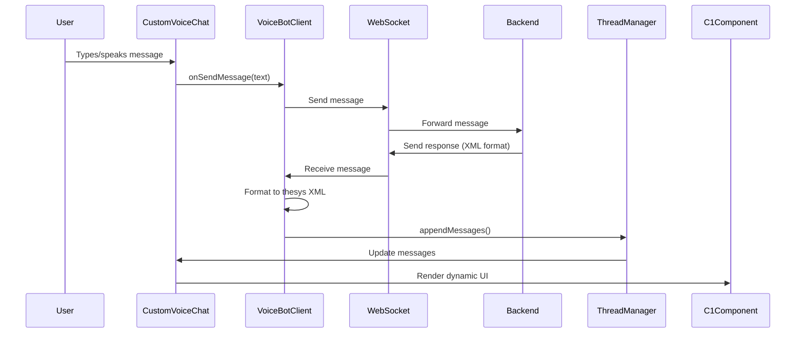
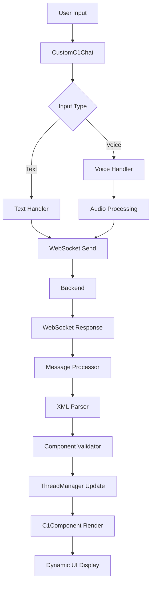

# CustomC1Chat Component Design Document

## Table of Contents
1. [Current Architecture Overview](#1-current-architecture-overview)
2. [Required Features](#2-required-features)
3. [Chosen Architecture](#3-chosen-architecture)
4. [Implementation Steps](#4-implementation-steps)

---

## 1. Current Architecture Overview

### 1.1 Project Structure
The current voice chat application consists of:

```
src/
├── components/
│   ├── VoiceBotClient.tsx    # Main WebSocket & voice handling
│   └── CustomVoiceChat.tsx   # UI component with C1Component integration
```

### 1.2 Key Components and Data Flow

#### VoiceBotClient.tsx
- **Purpose**: Manages WebSocket connection, voice recording, and message handling
- **Key Features**:
  - WebSocket connection management (`ws://` or `wss://`)
  - Voice recording via MediaRecorder API
  - WebRTC connection for real-time audio
  - Thread management using thesys SDK
  - Message formatting for thesys C1 components

#### CustomVoiceChat.tsx
- **Purpose**: Renders the chat UI with C1Component integration
- **Key Features**:
  - Custom chat interface styling
  - C1Component rendering for assistant messages
  - Voice status indicators
  - Text input with auto-resize
  - Message history display

### 1.3 Current Data Flow



### 1.4 Important Files and Their Roles

1. **@thesysai/genui-sdk** (index.js):
   - Provides C1Chat, C1Component, thread management
   - Component registry with 40+ UI components
   - XML parsing and validation
   - Streaming support
   - Form state management

2. **Message Format**:
   ```typescript
   // User message
   {
     id: string,
     role: 'user',
     message: string,
     type: 'prompt'
   }
   
   // Assistant message (thesys format)
   {
     id: string,
     role: 'assistant',
     message: [{
       type: 'template',
       name: 'c1',
       templateProps: {
         content: '<content>{...}</content><context>{...}</context>'
       }
     }]
   }
   ```

3. **WebSocket Message Types**:
   - `connection_ack`: Connection established
   - `user_text_message`: User text input
   - `voice_audio`: Voice recording data
   - `voice_response`: Assistant voice response
   - `user_transcription`: Voice-to-text result
   - `assistant_message`: Regular assistant response

### 1.5 Current Features
- ✅ WebSocket-based real-time messaging
- ✅ Voice recording and transcription
- ✅ Dynamic UI rendering via C1Component
- ✅ Thread management
- ✅ Custom chat UI styling
- ✅ Error handling and status messages
- ✅ Streaming support

---

## 2. Required Features

### 2.1 User Experience Goals
1. **Direct C1Chat Replacement**: Create a drop-in replacement for C1Chat that:
   - Maintains all existing C1Chat functionality
   - Integrates seamlessly with WebSocket messages
   - Preserves the current voice features

2. **Full Component Registry Access**: 
   - Use ALL thesys components (40+) without reimplementation
   - Support dynamic component rendering from XML
   - Maintain component interactions and state

3. **WebSocket Integration**:
   - Parse XML messages from backend
   - Handle streaming updates
   - Support all message types

### 2.2 Technical Requirements

1. **Component Reusability**:
   - Leverage thesys component registry (`wa` object in index.js)
   - Use existing validation and parsing logic
   - Maintain form state management capabilities

2. **Message Compatibility**:
   - Parse thesys XML format: `<content>{component}</content><context>{data}</context>`
   - Support streaming updates
   - Handle component actions and callbacks

3. **Feature Parity with C1Chat**:
   - Thread management
   - Message history
   - Component interactions
   - Theme support
   - Responsive design

---

## 3. Chosen Architecture

### 3.1 Architecture Overview

We'll create a `CustomC1Chat` component that:
1. Extends the existing C1Chat functionality
2. Integrates WebSocket message handling
3. Reuses all thesys components and infrastructure

### 3.2 Component Hierarchy

```
CustomC1Chat
├── WebSocketProvider (manages WS connection)
├── MessageProcessor (converts WS messages to thesys format)
├── C1ChatCore (modified C1Chat with WS support)
│   ├── ThreadManager (existing)
│   ├── MessageList
│   │   └── C1Component (renders each message)
│   └── InputArea (with voice controls)
└── VoiceController (voice recording/WebRTC)
```

### 3.3 Key Design Decisions

1. **Extend, Don't Replace**: We'll extend C1Chat rather than reimplementing it
2. **Reuse Component Registry**: Use the existing `wa` object and component definitions
3. **Preserve Message Format**: Keep the thesys message structure
4. **WebSocket as Transport**: Replace HTTP API calls with WebSocket messages
5. **Maintain Compatibility**: Ensure all existing features continue to work

### 3.4 Data Flow Architecture



---

## 4. Implementation Steps

### 4.1 Phase 1: Create WebSocket Integration Layer

#### Step 1.1: Create WebSocketProvider
```typescript
// src/components/WebSocketProvider.tsx
interface WebSocketContextType {
  ws: WebSocket | null;
  status: 'disconnected' | 'connecting' | 'connected';
  send: (message: any) => void;
  addMessageHandler: (handler: (data: any) => void) => void;
  removeMessageHandler: (handler: (data: any) => void) => void;
}
```

#### Step 1.2: Create Message Processor
```typescript
// src/components/MessageProcessor.tsx
class MessageProcessor {
  // Convert WebSocket messages to thesys format
  processIncomingMessage(wsMessage: any): ThesysMessage
  // Validate against thesys schema
  validateComponent(component: any): boolean
  // Handle streaming updates
  processStreamingUpdate(id: string, content: string): void
}
```

### 4.2 Phase 2: Extend C1Chat Component

#### Step 2.1: Create CustomC1Chat Wrapper
```typescript
// src/components/CustomC1Chat.tsx
import { C1Chat, useThreadManager, useThreadListManager } from '@thesysai/genui-sdk';

const CustomC1Chat: React.FC<CustomC1ChatProps> = (props) => {
  // Override processMessage to use WebSocket
  const customProcessMessage = async ({ message, abortController }) => {
    // Send via WebSocket instead of HTTP
    ws.send(formatForWebSocket(message));
    // Return empty - responses come via WS
    return [];
  };
  
  // Use existing thread management with custom processor
  const threadManager = useThreadManager({
    ...props,
    onProcessMessage: customProcessMessage
  });
  
  // Render modified C1Chat
  return <C1ChatCore {...props} threadManager={threadManager} />;
};
```

#### Step 2.2: Integrate WebSocket Message Handling
```typescript
// In CustomC1Chat
useEffect(() => {
  const handleWebSocketMessage = (data: any) => {
    const thesysMessage = messageProcessor.processIncomingMessage(data);
    threadManager.appendMessages(thesysMessage);
  };
  
  webSocketProvider.addMessageHandler(handleWebSocketMessage);
  return () => webSocketProvider.removeMessageHandler(handleWebSocketMessage);
}, []);
```

### 4.3 Phase 3: Voice Integration

#### Step 3.1: Extract Voice Logic
```typescript
// src/components/VoiceController.tsx
class VoiceController {
  // WebRTC connection management
  connectVoice(): Promise<void>
  // Audio recording
  startRecording(): void
  stopRecording(): void
  // Audio playback
  playAudioStream(stream: MediaStream): void
}
```

#### Step 3.2: Integrate Voice with CustomC1Chat
```typescript
// Add voice controls to input area
const InputAreaWithVoice = () => {
  const { voiceStatus, isRecording, ...voiceHandlers } = useVoiceController();
  
  return (
    <div className="input-area">
      <VoiceButton status={voiceStatus} {...voiceHandlers} />
      <TextInput />
      <SendButton />
    </div>
  );
};
```

### 4.4 Phase 4: Component Registry Integration

#### Step 4.1: Access Thesys Component Registry
```typescript
// src/utils/componentRegistry.ts
import { wa } from '@thesysai/genui-sdk/internals';

export const getComponentRegistry = () => wa;
export const validateComponent = (component: any) => {
  // Use thesys validation logic
};
```

#### Step 4.2: Ensure All Components Work
- Test each component from the registry
- Verify form state management
- Test component interactions/actions
- Validate streaming updates

### 4.5 Phase 5: Testing and Polish

#### Step 5.1: Comprehensive Testing
1. Test all 40+ thesys components
2. Verify WebSocket message handling
3. Test voice features
4. Validate streaming updates
5. Test error scenarios

#### Step 5.2: Performance Optimization
1. Implement message batching
2. Optimize re-renders
3. Add connection retry logic
4. Implement message queuing

#### Step 5.3: Documentation
1. API documentation
2. Usage examples
3. Migration guide from C1Chat
4. Component showcase

### 4.6 Implementation Timeline

- **Week 1**: WebSocket integration layer (Phase 1)
- **Week 2**: C1Chat extension (Phase 2)
- **Week 3**: Voice integration (Phase 3)
- **Week 4**: Component registry & testing (Phase 4-5)

### 4.7 Success Criteria

1. **Full Compatibility**: All thesys components render correctly
2. **WebSocket Integration**: Seamless message handling
3. **Voice Features**: All voice functionality preserved
4. **Performance**: No degradation vs original C1Chat
5. **Developer Experience**: Simple migration path

---

## Appendix: Key Code References

### A1. Thesys Component Registry (from index.js)
```javascript
const wa = {
  Accordion, Button, Card, CheckBoxGroup, CheckBoxItem,
  FollowUpBlock, ButtonGroup, CardHeader, Icon, IconButton,
  Image, ImageGallery, Input, ListBlock, RadioGroup,
  Select, SwitchGroup, Tabs, Tag, TagBlock, TextArea,
  TextContent, Table, Slider, LineChart, PieChart,
  RadarChart, RadialChart, BarChart, AreaChart,
  DatePicker, Form, Carousel, Steps, Callout
};
```

### A2. Message Format Examples
```xml
<!-- Simple text message -->
<content>
{
  "component": "TextContent",
  "props": {
    "textMarkdown": "Hello, world!"
  }
}
</content>

<!-- Complex UI with form -->
<content>
{
  "component": "Card",
  "props": {
    "children": [{
      "component": "Form",
      "props": {
        "name": "userForm",
        "children": [...]
      }
    }]
  }
}
</content>
<context>
{
  "userForm": {
    "field1": { "value": "..." }
  }
}
</context>
```

### A3. WebSocket Message Types
```typescript
interface WSMessage {
  type: 'connection_ack' | 'user_text_message' | 'voice_audio' | 
        'voice_response' | 'user_transcription' | 'assistant_message';
  content?: string;
  id?: string;
  // Additional fields based on type
}
``` 